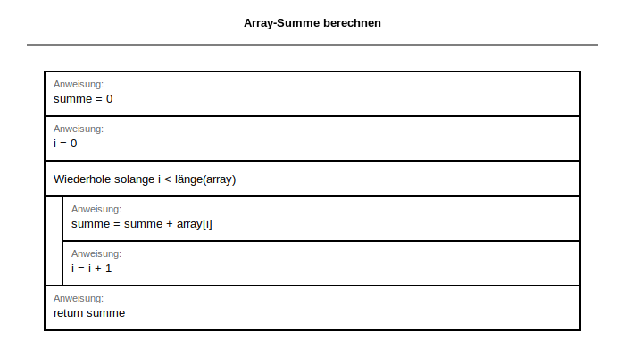

# 🚀 XML-SVG System: Setup & Installation

**Vollständige Anleitung zur Installation und Verwendung des XML-SVG Struktogramm-Systems**

---

## 📋 Überblick

```
XML Definition (*.xml)
    ↓
Pre-Commit Hook (automatisch!)
    ├─ Validierung (XSD-Schema)
    ├─ SVG-Generierung
    └─ Git Add SVG
    ↓
SVG Output (struktogramme/generated/svg/)
    ↓
Markdown Embedding
    ↓
Perfekte Darstellung!
```

---

## 🔧 Installation

### Schritt 1: Pre-Commit Hook installieren

```bash
# Im Repository-Root:
chmod +x .github/hooks/pre-commit-xml-svg
cp .github/hooks/pre-commit-xml-svg .git/hooks/pre-commit
```

**Validierung:**
```bash
ls -la .git/hooks/pre-commit
# Sollte: -rwxr-xr-x ... pre-commit anzeigen
```

### Schritt 2: Python-Abhängigkeiten (optional, aber empfohlen)

```bash
# System Python (bereits installiert im Dev Container)
python3 --version

# Weitere Abhängigkeiten: KEINE! (Nur Standard Library)
```

### Schritt 3: Verzeichnis-Struktur prüfen

```bash
# Diese Verzeichnisse sollten existieren:
ls -la struktogramme/xml_schemas/
ls -la struktogramme/xml_definitions/
ls -la struktogramme/converter/
ls -la struktogramme/generated/svg/
```

---

## 📝 Verwendung: Schritt-für-Schritt

### Beispiel 1: Neue Aufgabe erstellen

```bash
# 1. XML erstellen
cat > struktogramme/xml_definitions/L1_basis/L1_1_Neue_Aufgabe.xml << 'EOF'
<?xml version="1.0" encoding="UTF-8"?>
<struktogramm>
  <metadata>
    <titel>Neue Aufgabe</titel>
    <level>L1</level>
    <kategorie>Schleifen</kategorie>
  </metadata>
  <inhalt>
    <prozess>x = 0</prozess>
    <ausgabe>print(x)</ausgabe>
  </inhalt>
</struktogramm>
EOF

# 2. Git hinzufügen + Commit
git add struktogramme/xml_definitions/L1_basis/L1_1_Neue_Aufgabe.xml
git commit -m "Add: L1_1_Neue_Aufgabe"

# 🎉 Pre-Commit Hook läuft automatisch:
#    ✓ XML validieren
#    ✓ SVG generieren
#    ✓ SVG zu Git hinzufügen
```

### Beispiel 2: In Aufgabe einfügen

```markdown
# Meine Aufgabe

Folgendes Struktogramm zeigt die Lösung:



**Erklärung:** Das Struktogramm...
```

---

## 🧪 Test durchführen

### Test 1: Validator testen
```bash
python3 struktogramme/converter/struktogramm_xml_validator.py --dry-run
```

**Erwartete Ausgabe:**
```
🧪 DRY-RUN MODE - Beispiele werden validiert

======================================================================
📋 XML-Struktogramm Validierung
======================================================================
Gesamt: 1 | ✅ Gültig: 1 | ❌ Fehler: 0
======================================================================

✅ ALLE DATEIEN GÜLTIG!
```

### Test 2: Renderer testen
```bash
python3 struktogramme/converter/struktogramm_xml_renderer.py \
    struktogramme/xml_definitions/L1_basis/L1_1_Array_Summe.xml \
    /tmp/test.svg

# Prüfe ob SVG erzeugt wurde:
ls -la /tmp/test.svg
cat /tmp/test.svg | head -20  # Zeige erste 20 Zeilen
```

### Test 3: Komplette Pipeline testen

```bash
# 1. Test-XML erstellen
mkdir -p /tmp/test_struktogramme
cat > /tmp/test_struktogramme/TEST_Schema.xml << 'EOF'
<?xml version="1.0" encoding="UTF-8"?>
<struktogramm>
  <metadata>
    <titel>Schema Test</titel>
    <level>L2</level>
    <kategorie>Test</kategorie>
    <autor>TestBot</autor>
    <beschreibung>Test des kompletten Systems</beschreibung>
  </metadata>
  <inhalt>
    <zaehle>
      <variable>i</variable>
      <von>0</von>
      <bis>10</bis>
      <inhalt>
        <wenn>
          <bedingung>i &lt; 5</bedingung>
          <dann>
            <prozess>print("klein")</prozess>
          </dann>
          <sonst>
            <prozess>print("gross")</prozess>
          </sonst>
        </wenn>
      </inhalt>
    </zaehle>
    <ausgabe>return i</ausgabe>
  </inhalt>
</struktogramm>
EOF

# 2. Validieren
python3 struktogramme/converter/struktogramm_xml_validator.py /tmp/test_struktogramme/TEST_Schema.xml

# 3. SVG generieren
python3 struktogramme/converter/struktogramm_xml_renderer.py \
    /tmp/test_struktogramme/TEST_Schema.xml \
    /tmp/test_schema_output.svg

# 4. Prüfe Ausgabe
file /tmp/test_schema_output.svg
wc -l /tmp/test_schema_output.svg
```

**Erwartete Ausgaben:**
```
✅ ALLE DATEIEN GÜLTIG!
/tmp/test_schema_output.svg: SVG Scalable Vector Graphics image
299 /tmp/test_schema_output.svg  (ungefähr)
```

---

## 🐛 Troubleshooting

### Problem 1: Pre-Commit Hook läuft nicht

```bash
# Prüfe ob Hook ausführbar ist:
ls -la .git/hooks/pre-commit
# Sollte mit -rwx... beginnen

# Wenn nicht:
chmod +x .git/hooks/pre-commit

# Oder manuell testen:
bash .github/hooks/pre-commit-xml-svg
```

### Problem 2: "XML Parse Error"

```bash
# Prüfe XML-Syntax:
python3 << 'EOF'
import xml.etree.ElementTree as ET
tree = ET.parse("deine/datei.xml")
EOF

# Häufige Fehler:
# - Vergessenes Closing-Tag: </strukrogram>
# - Nicht escaped Zeichen: < oder > statt &lt; oder &gt;
# - BOM in UTF-8: File sollte UTF-8 ohne BOM sein
```

### Problem 3: SVG wird nicht generiert

```bash
# Prüfe Berechtigungen:
ls -la struktogramme/generated/svg/
# Sollte beschreibbar sein

# Manuell generieren mit Debug-Output:
python3 struktogramme/converter/struktogramm_xml_renderer.py \
    deine/datei.xml \
    /tmp/debug.svg

# Größe prüfen:
wc -l /tmp/debug.svg
# Sollte mindestens 20 Zeilen sein
```

### Problem 4: "Python module not found"

```bash
# Prüfe Python Path:
python3 -c "import sys; print(sys.path)"

# Oder verwende absoluten Path:
/usr/bin/python3 struktogramme/converter/struktogramm_xml_renderer.py ...
```

---

## ⚙️ Erweiterte Konfiguration

### Hook-Verhalten anpassen

**`.github/hooks/pre-commit-xml-svg` bearbeiten:**

```bash
# Zeile 17-20 ändern für andere Python-Version:
PYTHON3=$(which python3.11)  # Spezifische Version

# Zeile 25 für andere SVG-Verzeichnis:
SVG_DIR="/custom/pfad/svg"

# Zeile 38-40 für andere Validierungsregeln:
# (Im Moment nicht konfigurierbar - Validator.py anpassen)
```

### Validator-Regeln anpassen

**`struktogramme/converter/struktogramm_xml_validator.py` Zeile 150-160:**

```python
# Hier können neue Validierungsregeln hinzugefügt werden
# Beispiel: Maximale Verschachtelungstiefe
if depth > 5:  # Statt 4
    errors.append(...)
```

### SVG Rendering anpassen

**`struktogramme/converter/struktogramm_xml_renderer.py` Zeile 20-35:**

```python
class SVGConfig:
    LINE_HEIGHT = 60        # Höhe pro Element (in px)
    BOX_WIDTH = 500         # Breite (in px)
    FONT_SIZE = 12          # Schriftgröße (in px)
    PADDING = 20            # Innenabstand (in px)
    # ... weitere Parameter
```

---

## 📚 Checkliste für Produktion

Vor Merge in `main`:

- [ ] `.git/hooks/pre-commit` ist installiert und ausführbar
- [ ] `python3 --version` zeigt mindestens 3.8
- [ ] `struktogramme/generated/svg/` ist leer oder nur mit alten SVGs
- [ ] `struktogramme/xml_definitions/` hat mindestens 1 Beispiel-XML
- [ ] `python3 struktogramme/converter/struktogramm_xml_validator.py --dry-run` passt
- [ ] `.github/workflows/` kann neue XML-Files validieren
- [ ] GitHub Actions PR zeigt grünes Häkchen

---

## 🎓 Nächste Schritte

1. **Test durchführen** (siehe oben)
2. **Erste XML erstellen** (siehe Beispiel 1)
3. **In Aufgabe einfügen** (siehe Beispiel 2)
4. **Team informieren** (Link to this guide)
5. **Bestandsaufgaben migrieren** (später - Batch-Tool)

---

## 📞 Support

**Fragen oder Fehler?**

1. Prüfe diesen Guide (Troubleshooting)
2. Schau in `docs/handbuch/STRUKTOGRAMM_XML_GUIDE.md`
3. Validiere mit `--dry-run`: `python3 ... --dry-run`
4. Debugge manuell: `python3 ... -v`

---

*Letzte Aktualisierung: 2025-02-07*
*Version: 1.0*
