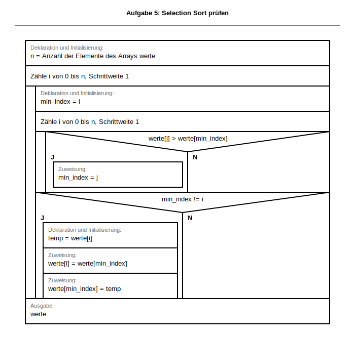

# Klassenarbeit:  Algorithmen und Datenstrukturen
<!-- DOCX-CODE-STYLING: bg=#F2F2F2, text=#111111, border=#C8C8C8 -->
## Informatik – Berufliches Gymnasium (Jahrgangsstufe 2)
<!-- DOCX-FUSSZEILE: Version 3 -->

---

## 📋 Prüfungsinformationen

| Eigenschaft | Details |
|---|---|
| **Datum** | _________________ |
| **Klasse** | _____________________ |
| **Dauer** | 60 Minuten |
| **Erreichbare Punkte** | 30 Punkte |
| **Hilfsmittel** | Keine (Papier , Stift, digitale Dokumentationsdatei) |
| **Themen** | Algorithmen (70%) und Datenstrukturen (30%) |

---

## 📌 Allgemeine Anweisungen

- Alle Antworten in der digitalen Vorlage dokumentieren. Alternativ das ausgehändigte Papier verwenden.
- Bei Aufgaben mit Struktogrammen: **Struktogramm ist erforderlich**
- **BW-Standard:** Operatorenliste für Struktogramme - in der aktuellsten Version (https://www.schule-bw.de/)
- Programmcode muss **eine gültige Python-Syntax** haben
- Bei Algorithmus-Aufgaben sind **eigene Schleifenlösungen** erwartet (keine eingebauten Such- oder Kurzformen)
- **Alle Zwischenschritte zeigen** – Korrektur erfolgt nach Rechenweg, nicht nur Endergebnis
- Analyseaufgaben: **Zweck und Fehlerursache** klar und nachvollziehbar begründen
- Bei Fragen: **Fragen Sie, bevor Sie spekulieren!**

---

## 📝 AUFGABENBLATT

### **Aufgabe 1: Verzweigung & Logik (3 Punkte)**
**Thema:** BPE 5.2 – Kontrollstrukturen (Alternativen)

Schreibe ein Struktogramm und implementiere in Python:
> Ein Programm liest eine Ganzzahl `alter` ein und gibt aus:
> - „Volljährig" wenn `alter >= 18`
> - „Minderjährig" wenn `alter < 18`

**Anforderungen:**
- Struktogramm mit korrektem Aufbau (3 Punkte)
  - Eingabe darstellen
  - Verzweigung mit Bedingung
  - Ausgaben korrekt positioniert

```python
# Lösung kommt in die digitale Lösungsdatei oder auf das ausgeteilte Papier!

```

---

### **Aufgabe 2: Schleife mit Bedingung (3 Punkte)**
**Thema:** BPE 5.2 – Schleifen & Bedingungen

Schreibe ein Struktogramm und implementiere:
> Ein Programm liest Ganzzahlen ein und führt eine laufende Summe.
> Das Programm endet bei `-1`.
> Nach jeder gültigen Eingabe wird die aktuelle Summe ausgegeben.

**Beispiel:**
```
Eingabe: 7
Summe: 7
Eingabe: 3
Summe: 10
Eingabe: -1
Programm endet
```

**Anforderungen:**
- Struktogramm (min. 2 Punkte):
  - Wiederholung korrekt dargestellt
  - Abbruchbedingung erkennbar
- Python-Code (1 Punkt):
  - Funktionsfähig und nachvollziehbar

```python
# Lösung kommt in die digitale Lösungsdatei oder auf das ausgeteilte Papier!

```

---

### **Aufgabe 3: Array-/Listen-Grundlagen (3 Punkte)**
**Thema:** BPE 7.1 – Arrays (Deklaration, Initialisierung, Zugriff)

Gegeben: `lager = [4, 7, 2, 9, 5, 1, 8, 3]`

**a) Deklaration (1 Punkt)**

Schreibe die Python-Zeile zur Deklaration und Initialisierung dieser Liste.

```python
# Lösung kommt in die digitale Lösungsdatei oder auf das ausgeteilte Papier!

```

**b) Zugriff (1 Punkt)**

Schreibe Python-Code, um:
- das **erste Element** auszugeben
- das **letzte Element** auf `10` zu setzen
- die **Länge** auszugeben

**Anforderungen:**
- Alle drei Operationen korrekt implementiert
- Python-Syntax korrekt

```python
# Lösung kommt in die digitale Lösungsdatei oder auf das ausgeteilte Papier!

```

**c) Interpretation (1 Punkt)**

Was bedeutet `lager[5]`? Erkläre kurz.

```
[Lösung kommt in die digitale Lösungsdatei oder auf das ausgeteilte Papier!]
```

---

### **Aufgabe 4: Array durchlaufen & filtern (6 Punkte)**
**Thema:** BPE 7.1 – Schleife über Arrays

Gegeben: `werte = [6, 17, 24, 31, 42, 55, 68, 73]`

**a) Alle Werte ausgeben (2 Punkte)**

Schreibe ein Struktogramm und Python-Code, um alle Werte zeilenweise auszugeben.

**Anforderungen:**
- Struktogramm (1 Punkt):
  - Schleife über Array erkennbar
  - Array-Zugriff mit Index
- Python-Code (1 Punkt):
  - Funktionsfähig und nachvollziehbar

```python
# Lösung kommt in die digitale Lösungsdatei oder auf das ausgeteilte Papier!

```

**b) Nur gerade Werte ausgeben (2 Punkte)**

Schreibe Python-Code, um nur die **geraden Werte** auszugeben.

**Anforderungen:**
- Bedingung (`% 2 == 0`) korrekt formuliert
- Nur gerade Werte werden ausgegeben

```python
# Lösung kommt in die digitale Lösungsdatei oder auf das ausgeteilte Papier!

```

**c) Neue Liste `halbiert` erzeugen (2 Punkte)**

Schreibe Python-Code, um eine neue Liste zu erzeugen, deren Elemente jeweils die **Ganzzahldivision durch 2** der ursprünglichen Werte sind.

**Anforderungen:**
- Neue Liste korrekt erzeugt
- Ganzzahldivision (`//`) verwendet
- Alle Elemente transformiert

```python
# Lösung kommt in die digitale Lösungsdatei oder auf das ausgeteilte Papier!

```

---

### **Aufgabe 5: Algorithmen prüfen (8 Punkte)**
**Thema:** BPE 7.2 – Algorithmenanalyse

Gegeben: `werte = [29, 14, 37, 10, 18]`

Das folgende Struktogramm wurde mit der BW-Operatorenliste (Draw.io-Library) entworfen und enthält **einen häufigen logischen Fehler** in einem Sortieralgorithmus.


<!-- DOCX-ALT-TEXT: L2_5_Aufgabe5_Algorithmen_pruefen_Fehleranalyse -->
<!-- DOCX-EMBED-SVG: ../../archiv/struktogramme/generated/svg/L2_5_Aufgabe5_Selection_Sort_Fehleranalyse.svg -->
<!-- DOCX-EMBEDDING-HINT: Dieses Struktogramm wird bei DOCX-Export als eingebettete Grafik dargestellt für bessere Kopierbarkeit und Formatierung. -->

Bearbeite die Teilaufgaben in dieser Reihenfolge:

**a) Vermuteter Zweck (3 Punkte)**

Beschreibe in 2–4 Sätzen, **welchen Zweck** der Algorithmus wahrscheinlich hat.

**Anforderungen:**
- Klare und nachvollziehbare Beschreibung
- Bezug auf Vergleichs- und Tauschlogik im Array erkennbar

```
[Lösung kommt in die digitale Lösungsdatei oder auf das ausgeteilte Papier!]
```

**b) Fehleranalyse (3 Punkte)**

Nenne den **logischen Fehler** im Struktogramm und erkläre kurz die Auswirkung auf die Programmausführung.

**Anforderungen:**
- Fehler klar identifiziert
- Auswirkung auf Sortierreihenfolge nachvollziehbar erklärt
- Konkretes Beispiel möglich

```
[Lösung kommt in die digitale Lösungsdatei oder auf das ausgeteilte Papier!]
```

**c) Korrekturvorschlag (2 Punkte)**

Formuliere die falsch gesetzte Vergleichsbedingung in **BW-konformer Operator-Notation** korrekt.

**Anforderungen:**
- Korrekte Notation nach Operatorenliste
- Lösung ist für aufsteigende Sortierung logisch korrekt

```
[Lösung kommt in die digitale Lösungsdatei oder auf das ausgeteilte Papier!]
```

---

### **Aufgabe 6: Lineare Suche implementieren (7 Punkte)**
**Thema:** BPE 7.2 – Suchalgorithmen (Lineare Suche)

Gegeben: `kunden_ids = [104, 117, 109, 123, 111, 130]` und `such_id = 123`

Schreibe ein Struktogramm und implementiere eine **Lineare Suche**, die den Index der gesuchten ID bestimmt.

**a) Struktogramm (3 Punkte)**

**Anforderungen:**
- Schleife zum Durchlaufen des Arrays
- Vergleich von aktuellem Element mit `such_id`
- Trefferfall eindeutig erkennbar (z. B. über Variable `gefunden_index`)
- Korrekte Verzweigung und Verschachtelung

```struktogramm
[Lösung kommt in die digitale Lösungsdatei oder auf das ausgeteilte Papier!]
```

**b) Python-Code (3 Punkte)**

**Anforderungen:**
- Vollständige lineare Suche mit Schleife
- Korrekte Behandlung von Treffer und Nicht-Treffer
- Rückgabe oder Ausgabe des gefundenen Index

```python
# Lösung kommt in die digitale Lösungsdatei oder auf das ausgeteilte Papier!

```

**c) Erwartete Ausgabe (1 Punkt)**

Welche Ausgabe entsteht für die gegebenen Daten (`kunden_ids`, `such_id = 123`)?

```
[Lösung kommt in die digitale Lösungsdatei oder auf das ausgeteilte Papier!]
```

---

## ✅ Checkliste vor Abgabe

- [ ] Alle Aufgaben bearbeitet
- [ ] Struktogramme lesbar und vollständig
- [ ] Python-Code syntaktisch korrekt (soweit möglich)
- [ ] Bei Algorithmusaufgaben nur Schleifenlösungen verwendet
- [ ] Alle Zwischenschritte zeigen – Korrektur erfolgt nach Rechenweg
- [ ] Fehleranalyse nachvollziehbar begründet
- [ ] Name & Datum oben eingetragen

---

**Viel Erfolg! 🚀**
