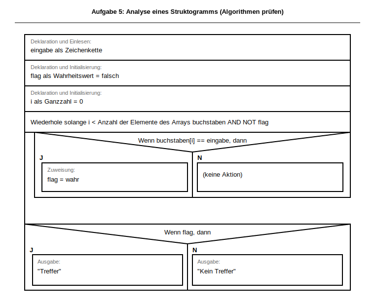

# Klassenarbeit:  Algorithmen und Datenstrukturen
## Informatik – Berufliches Gymnasium (Jahrgangsstufe 2)
<!-- DOCX-FUSSZEILE: Version 4 -->

---

## 📋 Prüfungsinformationen

| Eigenschaft | Details |
|---|---|
| **Datum** | _________________ |
| **Klasse** | _____________________ |
| **Dauer** | 60 Minuten |
| **Erreichbare Punkte** | 30 Punkte |
| **Hilfsmittel** | Keine (Papier , Stift, digitale Dokumentationsdatei) |
| **Themen** | Algorithmen (70%) und Datenstrukturen (30%) |

---

## 📌 Allgemeine Anweisungen

- Alle Antworten in der digitalen Vorlage dokumentieren. Alternativ das ausgehändigte Papier verwenden.
- Bei Aufgaben mit Struktogrammen: **Struktogramm ist erforderlich**
- **BW-Standard:** Operatorenliste für Struktogramme - in der aktuellsten Version (https://www.schule-bw.de/)
- Programmcode muss **eine gültige Python-Syntax** haben
- Bei Algorithmus-Aufgaben sind **eigene Schleifenlösungen** erwartet (keine eingebauten Such- oder Kurzformen)
- **Alle Zwischenschritte zeigen** – Korrektur erfolgt nach Rechenweg, nicht nur Endergebnis
- Analyseaufgaben: **Zweck und Fehlerursache** klar und nachvollziehbar begründen
- Bei Fragen: **Fragen Sie, bevor Sie spekulieren!**

---

## 📝 AUFGABENBLATT

### **Aufgabe 1: Verzweigung & Logik (3 Punkte)**
**Thema:** BPE 5.2 – Kontrollstrukturen (Alternativen)

Schreibe ein Struktogramm und implementiere in Python:
> Ein Programm liest eine Ganzzahl `zahl` ein und gibt aus:
> - „Gerade" wenn `zahl % 2 == 0`
> - „Ungerade" sonst

**Anforderungen:**
- Struktogramm mit korrektem Aufbau (3 Punkte)
  - Eingabe darstellen
  - Verzweigung mit Bedingung
  - Ausgaben korrekt positioniert

```python
# Lösung kommt in die digitale Lösungsdatei oder auf das ausgeteilte Papier!

```

---

### **Aufgabe 2: Schleife mit Bedingung (3 Punkte)**
**Thema:** BPE 5.2 – Schleifen & Bedingungen

Schreibe ein Struktogramm und implementiere:
> Ein Programm liest Ganzzahlen ein, **solange** der Nutzer möchte.
> Das Programm endet bei Eingabe `-1`.
> Nach jeder gültigen Eingabe soll die bisherige **größte Zahl** ausgegeben werden.

**Beispiel:**
```
Eingabe: 15
Größte: 15
Eingabe: 8
Größte: 15
Eingabe: 23
Größte: 23
Eingabe: -1
Programm endet
```

**Anforderungen:**
- Struktogramm (min. 2 Punkte):
  - Wiederholung korrekt dargestellt
  - Abbruchbedingung erkennbar
  - Vergleich für Maximum erkennbar
- Python-Code (1 Punkt):
  - Funktionsfähig und nachvollziehbar

```python
# Lösung kommt in die digitale Lösungsdatei oder auf das ausgeteilte Papier!

```

---

### **Aufgabe 3: Array-/Listen-Grundlagen (3 Punkte)**
**Thema:** BPE 7.1 – Arrays (Deklaration, Initialisierung, Zugriff)

Gegeben: `noten = [2, 3, 1, 4, 2, 5, 3, 1]`

**a) Deklaration und Initialisierung (1 Punkt)**

Schreibe die Python-Zeile zur Deklaration und Initialisierung dieser Liste.

```python
# Lösung kommt in die digitale Lösungsdatei oder auf das ausgeteilte Papier!

```

**b) Zugriff (1 Punkt)**

Schreibe Python-Code, um:
- das **dritte Element** auszugeben
- das **erste Element** auf `1` zu setzen
- die **Länge** auszugeben

**Anforderungen:**
- Alle drei Operationen korrekt implementiert
- Python-Syntax korrekt

```python
# Lösung kommt in die digitale Lösungsdatei oder auf das ausgeteilte Papier!

```

**c) Interpretation (1 Punkt)**

Erkläre, was `noten[6]` bedeutet und welcher Wert gemeint ist.

```
[Lösung kommt in die digitale Lösungsdatei oder auf das ausgeteilte Papier!]
```

---

### **Aufgabe 4: Array durchlaufen & filtern (6 Punkte)**
**Thema:** BPE 7.1 – Schleife über Arrays

Gegeben: `werte = [11, 28, 35, 40, 53, 64, 79, 82]`

**a) Alle Werte zeilenweise ausgeben (2 Punkte)**

Schreibe ein Struktogramm und Python-Code, um alle Werte zeilenweise auszugeben.

**Anforderungen:**
- Struktogramm (1 Punkt):
  - Schleife über Array erkennbar
  - Array-Zugriff mit Index
- Python-Code (1 Punkt):
  - Funktionsfähig und nachvollziehbar

```python
# Lösung kommt in die digitale Lösungsdatei oder auf das ausgeteilte Papier!

```

**b) Nur Werte >= 40 ausgeben (2 Punkte)**

Schreibe Python-Code, um nur die Werte auszugeben, die **>= 40** sind.

**Anforderungen:**
- Bedingung korrekt formuliert
- Nur passende Werte werden ausgegeben

```python
# Lösung kommt in die digitale Lösungsdatei oder auf das ausgeteilte Papier!

```

**c) Neue Liste `quadriert` erzeugen (2 Punkte)**

Schreibe Python-Code, um eine neue Liste zu erzeugen, deren Elemente jeweils das **Quadrat** der ursprünglichen Werte sind.

**Anforderungen:**
- Neue Liste korrekt erzeugt und benannt
- Quadrieren (`**2`) verwendet
- Alle Elemente transformiert

```python
# Lösung kommt in die digitale Lösungsdatei oder auf das ausgeteilte Papier!

```

---

### **Aufgabe 5: Algorithmen prüfen (8 Punkte)**
**Thema:** BPE 7.2 – Algorithmenanalyse

Gegeben: `buchstaben = ['H', 'I', 'N', 'W', 'E', 'I', 'S']`

Das folgende Struktogramm wurde mit der BW-Operatorenliste (Draw.io-Library) entworfen und enthält **einen häufigen logischen Fehler**.


<!-- DOCX-ALT-TEXT: L2_5_Aufgabe5_Algorithmen_pruefen_Fehleranalyse -->
<!-- DOCX-EMBED-SVG: ../../struktogramme/generated/svg/L2_5_Aufgabe5_Algorithmen_pruefen_Fehleranalyse.svg -->
<!-- DOCX-EMBEDDING-HINT: Dieses Struktogramm wird bei DOCX-Export als eingebettete Grafik dargestellt für bessere Kopierbarkeit und Formatierung. -->

Bearbeite die Teilaufgaben in dieser Reihenfolge:

**a) Zweck des Algorithmus (3 Punkte)**

Beschreibe in 2–4 Sätzen, **welchen Zweck** der Algorithmus wahrscheinlich hat.

**Anforderungen:**
- Klare und nachvollziehbare Beschreibung
- Bezug zu Array-Verarbeitung und Operationen erkennbar

```
[Lösung kommt in die digitale Lösungsdatei oder auf das ausgeteilte Papier!]
```

**b) Fehler und Auswirkung (3 Punkte)**

Nenne den **logischen Fehler** im Struktogramm und erkläre kurz die Auswirkung auf die Programmausführung.

**Anforderungen:**
- Fehler klar identifiziert
- Auswirkung nachvollziehbar erklärt
- Konkretes Beispiel mit `buchstaben` möglich

```
[Lösung kommt in die digitale Lösungsdatei oder auf das ausgeteilte Papier!]
```

**c) Korrekturvorschlag in BW-Operatornotation (2 Punkte)**

Formuliere die fehlende/falsch platzierte Anweisung korrekt in **BW-Operatornotation**.

**Anforderungen:**
- Korrekte Notation nach Operatorenliste
- Lösung ist logisch korrekt

```
[Lösung kommt in die digitale Lösungsdatei oder auf das ausgeteilte Papier!]
```

---

### **Aufgabe 6: Selection Sort implementieren (7 Punkte)**
**Thema:** BPE 7.2 – Sortieralgorithmen (Selection Sort)

Gegeben: `zahlen = [33, 12, 27, 5, 18]`

Schreibe ein Struktogramm und implementiere **Selection Sort aufsteigend**.

**a) Struktogramm (3 Punkte)**

**Anforderungen:**
- Äußere Schleife (Position `i`)
- Innerer Durchlauf (Minimum finden)
- Tausch an Position `i`
- Korrekte Verschachtelung

```struktogramm
[Lösung kommt in die digitale Lösungsdatei oder auf das ausgeteilte Papier!]
```

**b) Python-Code (3 Punkte)**

**Anforderungen:**
- Verschachtelte Schleifen
- Klare Tauschlogik
- Sortierung aufsteigend

```python
# Lösung kommt in die digitale Lösungsdatei oder auf das ausgeteilte Papier!

```

**c) Sortierte Ausgabe (1 Punkt)**

Wie sieht das sortierte Array aus?

```
[Lösung kommt in die digitale Lösungsdatei oder auf das ausgeteilte Papier!]
```

---

## ✅ Checkliste vor Abgabe

- [ ] Alle Aufgaben bearbeitet
- [ ] Struktogramme lesbar und vollständig
- [ ] Python-Code syntaktisch korrekt (soweit möglich)
- [ ] Bei Algorithmusaufgaben nur Schleifenlösungen verwendet
- [ ] Alle Zwischenschritte zeigen – Korrektur erfolgt nach Rechenweg
- [ ] Fehleranalyse nachvollziehbar begründet
- [ ] Name & Datum oben eingetragen

---

**Viel Erfolg! 🚀**
