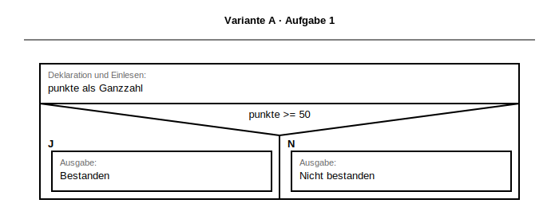
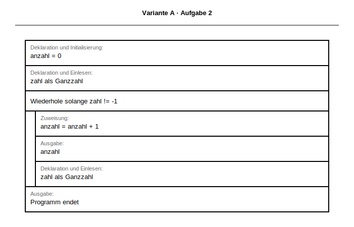
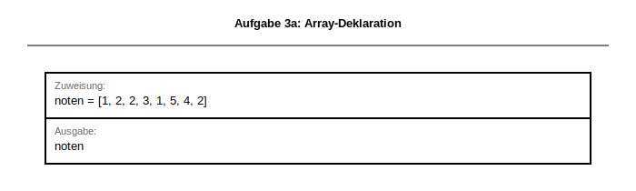
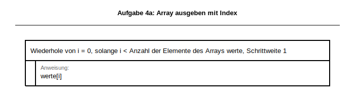
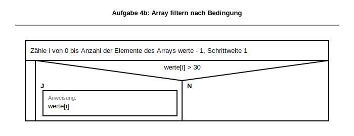
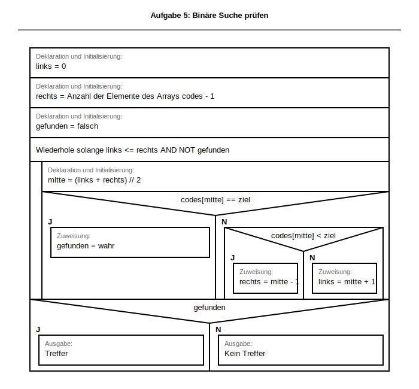
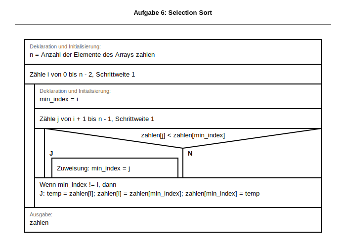

# Musterlösung & Erwartungshorizont
<!-- DOCX-CODE-STYLING: bg=#F2F2F2, text=#111111, border=#C8C8C8 -->
## Klassenarbeit:  Algorithmen und Datenstrukturen
<!-- DOCX-FUSSZEILE: Version 2 -->

**Dokumentation für Lehrkräfte**

**DOCX-Layoutvorgabe (Quellcode):** Alle Python-Quellcodelösungen sind als kopierbare Codeblöcke in einer hellgrauen Box auszugeben (Hintergrund `#F2F2F2`, Schrift `#111111`, Rahmen `#C8C8C8`).

Bezug: [docs/lehrplan/BPE5_Grundlagen_Programmierung.md](../lehrplan/BPE5_Grundlagen_Programmierung.md) und [docs/lehrplan/BPE7_Algorithmen_Datenstrukturen.md](../lehrplan/BPE7_Algorithmen_Datenstrukturen.md)

SVG-Basis: BW-Formvorlagen aus `apps/drawio-extension/stencil.xml`.

---

## 📌 Übersicht Erwartungshorizont

| Aufgabe | Punkte | Lösungstyp | Bewertung |
|---------|--------|-----------|----------|
| 1 | 3 | Struktogramm + Code | Bedingung + Ausgaben korrekt |
| 2 | 3 | Struktogramm + Code | Schleifenlogik + Abbruch |
| 3 | 3 | Deklaration/Zugriff/Interpretation | Indizes korrekt |
| 4 | 6 | Array-Algorithmen | je Teilaufgabe 2 Punkte |
| 5 | 8 | Fehleranalyse | Ursache + Auswirkung + Korrektur |
| 6 | 7 | Selection Sort | Min-Suche + Tauschlogik |
| **Summe** | **30** | — | — |

---

## ✅ MUSTERLÖSUNGEN MIT BEWERTUNG

### Aufgabe 1: Verzweigung & Logik (3 Punkte)

**Aufgabenstellung (aus Prüfungsblatt):**
> **Thema:** BPE 5.2 – Kontrollstrukturen (Alternativen)
>
> Schreibe ein Struktogramm und implementiere in Python:
> > Ein Programm liest eine Ganzzahl `punkte` ein und gibt aus:
> > - „Bestanden" wenn `punkte >= 50`
> > - „Nicht bestanden" wenn `punkte < 50`
>
> **Anforderungen:**
> - Struktogramm mit korrektem Aufbau (3 Punkte)
> - Eingabe darstellen
> - Verzweigung mit Bedingung
> - Ausgaben korrekt positioniert

**Struktogramm (BW-Standard, SVG):**


<!-- DOCX-ALT-TEXT: L2_VarA_Aufgabe1_Bestanden -->
<!-- DOCX-EMBED-SVG: ../../struktogramme/generated/svg/L2_VarA_Aufgabe1_Bestanden.svg -->
<!-- DOCX-EMBEDDING-HINT: Dieses Struktogramm wird bei DOCX-Export als eingebettete Grafik dargestellt für bessere Kopierbarkeit und Formatierung. -->

**BW-Notation (Operatorenliste v2.2):**
```struktogramm
Deklaration und Einlesen: punkte als Ganzzahl
Wenn punkte >= 50, dann
    J
        Ausgabe: "Bestanden"
    , sonst
    N
        Ausgabe: "Nicht bestanden"
```

**Python-Musterlösung:**
```python
def loese_aufgabe1_bestanden() -> None:
    punkte = int(input("Punkte: "))
    if punkte >= 50:
        print("Bestanden")
    else:
        print("Nicht bestanden")
```

**Bewertung (3):**
- Struktogramm korrekt (1)
- Python-Syntax korrekt (1)
- Logik korrekt (1)

---

### Aufgabe 2: Schleife mit Bedingung (3 Punkte)

**Aufgabenstellung (aus Prüfungsblatt):**
> **Thema:** BPE 5.2 – Schleifen & Bedingungen
>
> Schreibe ein Struktogramm und implementiere:
> > Ein Programm liest Ganzzahlen ein. Nach jeder Eingabe wird die bisherige **Anzahl gültiger Eingaben** ausgegeben.
> > Das Programm endet bei Eingabe `-1`.
>
> **Beispiel:**

**Struktogramm (BW-Standard, SVG):**


<!-- DOCX-ALT-TEXT: L2_VarA_Aufgabe2_Anzahl_Bis_Abbruch -->
<!-- DOCX-EMBED-SVG: ../../struktogramme/generated/svg/L2_VarA_Aufgabe2_Anzahl_Bis_Abbruch.svg -->
<!-- DOCX-EMBEDDING-HINT: Dieses Struktogramm wird bei DOCX-Export als eingebettete Grafik dargestellt für bessere Kopierbarkeit und Formatierung. -->

**BW-Notation (Operatorenliste v2.2):**
```struktogramm
Deklaration und Initialisierung: anzahl = 0
Deklaration und Einlesen: zahl als Ganzzahl
Wiederhole solange zahl != -1
    Zuweisung: anzahl = anzahl + 1
    Ausgabe: anzahl
    Deklaration und Einlesen: zahl als Ganzzahl
Ausgabe: "Programm endet"
```

**Python-Musterlösung:**
```python
def loese_aufgabe2_anzahl() -> None:
    anzahl = 0
    zahl = int(input("Zahl (-1 zum Ende): "))
    while zahl != -1:
        anzahl += 1
        print(f"Anzahl: {anzahl}")
        zahl = int(input("Zahl (-1 zum Ende): "))
    print("Programm endet")
```

**Bewertung (3):**
- Schleifenstruktur (2)
- Funktionierender Code (1)

---

### Aufgabe 3: Array-/Listen-Grundlagen (3 Punkte)

**Aufgabenstellung (aus Prüfungsblatt):**
> **Thema:** BPE 7.1 – Arrays (Listen) (Deklaration, Initialisierung, Zugriff)
>
> Gegeben ist die Liste:
> `temperaturen = [18, 21, 19, 23, 17, 20, 22, 16]`

**a) Deklaration (1):**


<!-- DOCX-ALT-TEXT: L2_3a_Aufgabe3_Array_Deklaration -->
<!-- DOCX-EMBED-SVG: ../../struktogramme/generated/svg/L2_3a_Aufgabe3_Array_Deklaration.svg -->
<!-- DOCX-EMBEDDING-HINT: Dieses Struktogramm wird bei DOCX-Export als eingebettete Grafik dargestellt für bessere Kopierbarkeit und Formatierung. -->

```python
temperaturen = [18, 21, 19, 23, 17, 20, 22, 16]
```

**b) Zugriff (1):**


<!-- DOCX-ALT-TEXT: L2_3b_Aufgabe3_Array_Zugriff -->
<!-- DOCX-EMBED-SVG: ../../struktogramme/generated/svg/L2_3b_Aufgabe3_Array_Zugriff.svg -->
<!-- DOCX-EMBEDDING-HINT: Dieses Struktogramm wird bei DOCX-Export als eingebettete Grafik dargestellt für bessere Kopierbarkeit und Formatierung. -->

```python
zweites = temperaturen[1]
temperaturen[-2] = 25
laenge = len(temperaturen)
print(zweites, laenge)
```

**c) Interpretation (1):**
`temperaturen[4]` ist das 5. Element (Wert: `17`).

---

### Aufgabe 4: Array (Liste) durchlaufen & filtern (6 Punkte)

**Aufgabenstellung (aus Prüfungsblatt):**
> **Thema:** BPE 7.1 – Schleife über Arrays (Listen)
>
> Gegeben ist: `werte = [14, 9, 31, 27, 45, 12, 6, 39]`

Gegeben: `werte = [14, 9, 31, 27, 45, 12, 6, 39]`

**a) Alle Werte ausgeben (2):**


<!-- DOCX-ALT-TEXT: L2_4a_Aufgabe4_Array_Ausgeben_Index -->
<!-- DOCX-EMBED-SVG: ../../struktogramme/generated/svg/L2_4a_Aufgabe4_Array_Ausgeben_Index.svg -->
<!-- DOCX-EMBEDDING-HINT: Dieses Struktogramm wird bei DOCX-Export als eingebettete Grafik dargestellt für bessere Kopierbarkeit und Formatierung. -->

```python
for wert in werte:
    print(wert)
```

**b) Durch 3 teilbar (2):**


<!-- DOCX-ALT-TEXT: L2_4b_Aufgabe4_Array_Filtern -->
<!-- DOCX-EMBED-SVG: ../../struktogramme/generated/svg/L2_4b_Aufgabe4_Array_Filtern.svg -->
<!-- DOCX-EMBEDDING-HINT: Dieses Struktogramm wird bei DOCX-Export als eingebettete Grafik dargestellt für bessere Kopierbarkeit und Formatierung. -->

```python
for wert in werte:
    if wert % 3 == 0:
        print(wert)
```

**c) Neue Liste plus_fuenf (2):**


<!-- DOCX-ALT-TEXT: L2_4c1_Aufgabe4_Array_Verdoppeln_Neue_Liste -->
<!-- DOCX-EMBED-SVG: ../../struktogramme/generated/svg/L2_4c1_Aufgabe4_Array_Verdoppeln_Neue_Liste.svg -->
<!-- DOCX-EMBEDDING-HINT: Dieses Struktogramm wird bei DOCX-Export als eingebettete Grafik dargestellt für bessere Kopierbarkeit und Formatierung. -->

```python
plus_fuenf: list[int] = []
for wert in werte:
    plus_fuenf.append(wert + 5)
print(plus_fuenf)
```

---

### Aufgabe 5: Algorithmen prüfen (8 Punkte)

**Aufgabenstellung (aus Prüfungsblatt):**
> **Thema:** BPE 7.2 – Algorithmenanalyse
>
> Gegeben: `codes = ['K1', 'K2', 'K3', 'K4', 'K5', 'K6', 'K7']` (sortiert)
>
> Das folgende Struktogramm wurde mit der BW-Operatorenliste (Draw.io-Library) entworfen und enthält **einen häufigen logischen Fehler** in einem Suchalgorithmus.
>
> 
> <!-- DOCX-ALT-TEXT: L2_5_Aufgabe5_Algorithmen_pruefen_Fehleranalyse -->
> <!-- DOCX-EMBED-SVG: ../../struktogramme/generated/svg/L2_5_Aufgabe5_Binaere_Suche_Fehleranalyse.svg -->
> <!-- DOCX-EMBEDDING-HINT: Dieses Struktogramm wird bei DOCX-Export als eingebettete Grafik dargestellt für bessere Kopierbarkeit und Formatierung. -->
>
> Bearbeite die Teilaufgaben in dieser Reihenfolge:

**Fehlerhaftes Struktogramm:**


<!-- DOCX-ALT-TEXT: L2_5_Aufgabe5_Binaere_Suche_Fehleranalyse -->
<!-- DOCX-EMBED-SVG: ../../struktogramme/generated/svg/L2_5_Aufgabe5_Binaere_Suche_Fehleranalyse.svg -->
<!-- DOCX-EMBEDDING-HINT: Dieses Struktogramm wird bei DOCX-Export als eingebettete Grafik dargestellt für bessere Kopierbarkeit und Formatierung. -->

**a) Zweck (3):**
Der Algorithmus soll eine Binärsuche in der sortierten Liste `codes` durchführen.
Dabei wird in jeder Iteration die Mitte des aktuellen Suchbereichs geprüft und der Bereich halbiert.
Bei Treffer wird `gefunden` auf `wahr` gesetzt, sonst wird links/rechts entsprechend angepasst.

**b) Fehleranalyse (3):**
Im inneren Vergleichszweig sind die Aktualisierungen vertauscht:
- Bei `codes[mitte] < ziel` müsste `links = mitte + 1` gesetzt werden.
- Im anderen Fall müsste `rechts = mitte - 1` gesetzt werden.
Durch die Vertauschung wird der falsche Teilbereich verworfen, die Suche kann den Treffer verfehlen.

**c) Korrektur (2):**
```struktogramm
Wenn codes[mitte] < ziel, dann
    J
        Zuweisung: links = mitte + 1
    , sonst
    N
        Zuweisung: rechts = mitte - 1
```

---

### Aufgabe 6: Selection Sort implementieren (7 Punkte)

**Aufgabenstellung (aus Prüfungsblatt):**
> **Thema:** BPE 7.2 – Sortieralgorithmen (Selection Sort)
>
> Gegeben: `zahlen = [29, 14, 37, 10, 18]`
>
> Schreibe ein Struktogramm und implementiere **Selection Sort aufsteigend**.

**a) Struktogramm (3):**


<!-- DOCX-ALT-TEXT: L2_6_Aufgabe6_Selection_Sort -->
<!-- DOCX-EMBED-SVG: ../../struktogramme/generated/svg/L2_6_Aufgabe6_Selection_Sort.svg -->
<!-- DOCX-EMBEDDING-HINT: Dieses Struktogramm wird bei DOCX-Export als eingebettete Grafik dargestellt für bessere Kopierbarkeit und Formatierung. -->

**BW-Notation (Operatorenliste v2.2):**
```struktogramm
Deklaration und Initialisierung: zahlen = [29, 14, 37, 10, 18]
Deklaration und Initialisierung: n = Anzahl der Elemente des Arrays zahlen
Zähle i von 0 bis n - 2, Schrittweite 1
    Deklaration und Initialisierung: min_index = i
    Zähle j von i + 1 bis n - 1, Schrittweite 1
        Wenn zahlen[j] < zahlen[min_index], dann
            J
                Zuweisung: min_index = j
            , sonst
            N
                [keine Anweisung]
    Wenn min_index != i, dann
        J
            Deklaration und Initialisierung: temp = zahlen[i]
            Zuweisung: zahlen[i] = zahlen[min_index]
            Zuweisung: zahlen[min_index] = temp
        , sonst
        N
            [keine Anweisung]
Ausgabe: zahlen
```

**b) Python-Code (3):**
```python
def loese_aufgabe6_selection_sort(zahlen: list[int]) -> list[int]:
    sortierte = zahlen.copy()
    n = len(sortierte)
    for i in range(n - 1):
        min_index = i
        for j in range(i + 1, n):
            if sortierte[j] < sortierte[min_index]:
                min_index = j
        if min_index != i:
            temp = sortierte[i]
            sortierte[i] = sortierte[min_index]
            sortierte[min_index] = temp
    return sortierte

print(loese_aufgabe6_selection_sort([29, 14, 37, 10, 18]))
```

**c) Ausgabe (1):**
`[10, 14, 18, 29, 37]`

---

## 📊 Kurzbewertung

- **Kritisch bei Aufgabe 5:** Fehlerursache muss korrekt benannt sein.
- **Kritisch bei Aufgabe 6:** Minimum-Suche + Tausch an Position `i`.
- **Teilpunkte** bei nachvollziehbarer Zwischenlogik vergeben.

---

