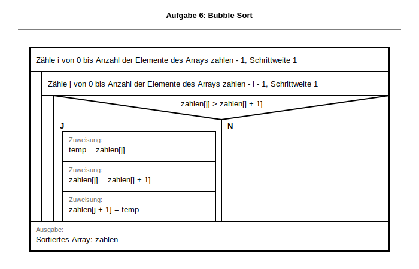

# Musterlösung & Erwartungshorizont
<!-- DOCX-CODE-STYLING: bg=#F2F2F2, text=#111111, border=#C8C8C8 -->
## Klassenarbeit:  Algorithmen und Datenstrukturen
<!-- DOCX-FUSSZEILE: Version 3 -->

**Dokumentation für Lehrkräfte**

**DOCX-Layoutvorgabe (Quellcode):** Alle Python-Quellcodelösungen sind als kopierbare Codeblöcke in einer hellgrauen Box auszugeben (Hintergrund `#F2F2F2`, Schrift `#111111`, Rahmen `#C8C8C8`).

Bezug: [docs/lehrplan/BPE5_Grundlagen_Programmierung.md](../lehrplan/BPE5_Grundlagen_Programmierung.md) und [docs/lehrplan/BPE7_Algorithmen_Datenstrukturen.md](../lehrplan/BPE7_Algorithmen_Datenstrukturen.md)

SVG-Basis: BW-Formvorlagen aus `apps/drawio-extension/stencil.xml`.

---

## 📌 Übersicht Erwartungshorizont

| Aufgabe | Punkte | Lösungstyp | Kritisch |
|---------|--------|-----------|----------|
| 1 | 3 | Struktogramm + Code | Bedingung korrekt |
| 2 | 3 | Struktogramm + Code | Schleifenabbruch |
| 3 | 3 | Grundlagen Arrays | Indexverständnis |
| 4 | 6 | Array-Algorithmen | Filter + neue Liste |
| 5 | 8 | Fehleranalyse | Ursache + Wirkung |
| 6 | 7 | Bubble Sort | Swap-Logik + Grenzen |
| **Summe** | **30** | — | — |

---

## ✅ MUSTERLÖSUNGEN MIT BEWERTUNG

### Aufgabe 1 (3)

**Aufgabenstellung (aus Prüfungsblatt):**
> Eingabe: Ganzzahl `alter`
> - „Volljährig" bei `alter >= 18`
> - „Minderjährig" bei `alter < 18`


<!-- DOCX-ALT-TEXT: L2_VarB_Aufgabe1_Volljaehrig -->
<!-- DOCX-EMBED-SVG: ../../struktogramme/generated/svg/L2_VarB_Aufgabe1_Volljaehrig.svg -->
<!-- DOCX-EMBEDDING-HINT: Dieses Struktogramm wird bei DOCX-Export als eingebettete Grafik dargestellt für bessere Kopierbarkeit und Formatierung. -->

```struktogramm
Deklaration und Einlesen: alter als Ganzzahl
Wenn alter >= 18, dann
    J
        Ausgabe: "Volljährig"
    , sonst
    N
        Ausgabe: "Minderjährig"
```

```python
def loese_aufgabe1_volljaehrig() -> None:
    alter = int(input("Alter: "))
    if alter >= 18:
        print("Volljährig")
    else:
        print("Minderjährig")
```

---

### Aufgabe 2 (3)

**Aufgabenstellung (aus Prüfungsblatt):**
> Ein Programm liest Ganzzahlen ein und führt eine laufende Summe.
> Das Programm endet bei `-1`.
> Nach jeder gültigen Eingabe wird die aktuelle Summe ausgegeben.


<!-- DOCX-ALT-TEXT: L2_VarB_Aufgabe2_Laufende_Summe -->
<!-- DOCX-EMBED-SVG: ../../struktogramme/generated/svg/L2_VarB_Aufgabe2_Laufende_Summe.svg -->
<!-- DOCX-EMBEDDING-HINT: Dieses Struktogramm wird bei DOCX-Export als eingebettete Grafik dargestellt für bessere Kopierbarkeit und Formatierung. -->

```struktogramm
Deklaration und Initialisierung: summe = 0
Deklaration und Einlesen: zahl als Ganzzahl
Wiederhole solange zahl != -1
    Zuweisung: summe = summe + zahl
    Ausgabe: summe
    Deklaration und Einlesen: zahl als Ganzzahl
Ausgabe: "Programm endet"
```

```python
def loese_aufgabe2_laufende_summe() -> None:
    summe = 0
    zahl = int(input("Zahl (-1 Ende): "))
    while zahl != -1:
        summe += zahl
        print(f"Summe: {summe}")
        zahl = int(input("Zahl (-1 Ende): "))
    print("Programm endet")
```

---

### Aufgabe 3 (3)

**Aufgabenstellung (aus Prüfungsblatt):**
> Gegeben: `lager = [4, 7, 2, 9, 5, 1, 8, 3]`
> a) Deklaration
> b) Zugriff: erstes Element ausgeben, letztes Element auf `10` setzen, Länge ausgeben
> c) Bedeutung von `lager[5]` erläutern

**a)**

<!-- DOCX-ALT-TEXT: L2_3a_Aufgabe3_Array_Deklaration -->
<!-- DOCX-EMBED-SVG: ../../struktogramme/generated/svg/L2_3a_Aufgabe3_Array_Deklaration.svg -->
<!-- DOCX-EMBEDDING-HINT: Dieses Struktogramm wird bei DOCX-Export als eingebettete Grafik dargestellt für bessere Kopierbarkeit und Formatierung. -->

```python
lager = [4, 7, 2, 9, 5, 1, 8, 3]
```

**b)**

<!-- DOCX-ALT-TEXT: L2_3b_Aufgabe3_Array_Zugriff -->
<!-- DOCX-EMBED-SVG: ../../struktogramme/generated/svg/L2_3b_Aufgabe3_Array_Zugriff.svg -->
<!-- DOCX-EMBEDDING-HINT: Dieses Struktogramm wird bei DOCX-Export als eingebettete Grafik dargestellt für bessere Kopierbarkeit und Formatierung. -->

```python
erstes = lager[0]
lager[-1] = 10
laenge = len(lager)
print(erstes, laenge)
```

**c)**
`lager[5]` = 6. Element, hier Wert `1`.

---

### Aufgabe 4 (6)

**Aufgabenstellung (aus Prüfungsblatt):**
> Gegeben: `werte = [6, 17, 24, 31, 42, 55, 68, 73]`
> a) Alle Werte ausgeben
> b) Nur gerade Werte ausgeben
> c) Neue Liste `halbiert` erzeugen (Ganzzahldivision durch 2)

**a) Alle Werte ausgeben (2):**

<!-- DOCX-ALT-TEXT: L2_4a_Aufgabe4_Array_Ausgeben_Index -->
<!-- DOCX-EMBED-SVG: ../../struktogramme/generated/svg/L2_4a_Aufgabe4_Array_Ausgeben_Index.svg -->
<!-- DOCX-EMBEDDING-HINT: Dieses Struktogramm wird bei DOCX-Export als eingebettete Grafik dargestellt für bessere Kopierbarkeit und Formatierung. -->

```python
for wert in werte:
    print(wert)
```

**b) Nur gerade Werte (2):**

<!-- DOCX-ALT-TEXT: L2_4b_Aufgabe4_Array_Filtern -->
<!-- DOCX-EMBED-SVG: ../../struktogramme/generated/svg/L2_4b_Aufgabe4_Array_Filtern.svg -->
<!-- DOCX-EMBEDDING-HINT: Dieses Struktogramm wird bei DOCX-Export als eingebettete Grafik dargestellt für bessere Kopierbarkeit und Formatierung. -->

```python
for wert in werte:
    if wert % 2 == 0:
        print(wert)
```

**c) Liste halbiert (2):**

<!-- DOCX-ALT-TEXT: L2_4c1_Aufgabe4_Array_Verdoppeln_Neue_Liste -->
<!-- DOCX-EMBED-SVG: ../../struktogramme/generated/svg/L2_4c1_Aufgabe4_Array_Verdoppeln_Neue_Liste.svg -->
<!-- DOCX-EMBEDDING-HINT: Dieses Struktogramm wird bei DOCX-Export als eingebettete Grafik dargestellt für bessere Kopierbarkeit und Formatierung. -->

```python
halbiert: list[int] = []
for wert in werte:
    halbiert.append(wert // 2)
print(halbiert)
```

---

### Aufgabe 5 (8)

**Aufgabenstellung (aus Prüfungsblatt):**
> Gegeben: `werte = [29, 14, 37, 10, 18]`
> Analysiere das fehlerhafte Struktogramm:
> a) vermuteter Zweck
> b) logischer Fehler + Auswirkung
> c) Korrektur in BW-Operatornotation


<!-- DOCX-ALT-TEXT: L2_5_Aufgabe5_Selection_Sort_Fehleranalyse -->
<!-- DOCX-EMBED-SVG: ../../struktogramme/generated/svg/L2_5_Aufgabe5_Selection_Sort_Fehleranalyse.svg -->
<!-- DOCX-EMBEDDING-HINT: Dieses Struktogramm wird bei DOCX-Export als eingebettete Grafik dargestellt für bessere Kopierbarkeit und Formatierung. -->

- **a) Zweck (3):** Selection Sort aufsteigend: in jedem Durchlauf das Minimum im Restfeld finden und an Position `i` tauschen.
- **b) Fehler (3):** Die Vergleichsbedingung ist invertiert (`werte[j] > werte[min_index]` statt `<`). Dadurch wird das Maximum gewählt und die Reihenfolge wird nicht aufsteigend sortiert.
- **c) Korrektur (2):**
```struktogramm
Wenn werte[j] < werte[min_index], dann
    J
        Zuweisung: min_index = j
```

---

### Aufgabe 6: Bubble Sort (7)

**Aufgabenstellung (aus Prüfungsblatt):**
> Gegeben: `zahlen = [42, 7, 19, 3, 25]`
> Schreibe Struktogramm + Python-Code für **Bubble Sort (aufsteigend)**.
> Gib die sortierte Ausgabe an.

**a) Struktogramm (3):**


<!-- DOCX-ALT-TEXT: L2_6_Aufgabe6_Bubble_Sort -->
<!-- DOCX-EMBED-SVG: ../../struktogramme/generated/svg/L2_6_Aufgabe6_Bubble_Sort.svg -->
<!-- DOCX-EMBEDDING-HINT: Dieses Struktogramm wird bei DOCX-Export als eingebettete Grafik dargestellt für bessere Kopierbarkeit und Formatierung. -->

**b) Python (3):**
```python
def loese_aufgabe6_bubble_sort(zahlen: list[int]) -> list[int]:
    sortierte = zahlen.copy()
    n = len(sortierte)

    for i in range(n - 1):
        for j in range(n - 1 - i):
            if sortierte[j] > sortierte[j + 1]:
                temp = sortierte[j]
                sortierte[j] = sortierte[j + 1]
                sortierte[j + 1] = temp

    return sortierte

print(loese_aufgabe6_bubble_sort([42, 7, 19, 3, 25]))
```

**c) Ausgabe (1):**
`[3, 7, 19, 25, 42]`

---

## ⚠️ Korrekturhinweise

- Teilpunkte bei korrekter Schleifenstruktur vergeben.
- Bei Aufgabe 6 ist `if a[j] > a[j+1]` die zentrale Bedingung.
- Bei Aufgabe 5 reicht ein präziser, korrekter Fehlerhinweis für hohe Teilpunktzahl.

---

