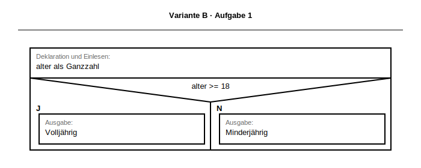
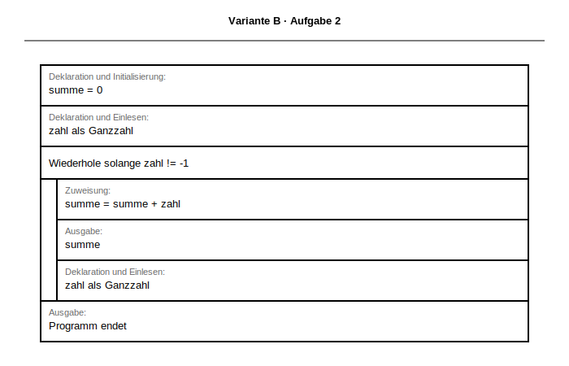
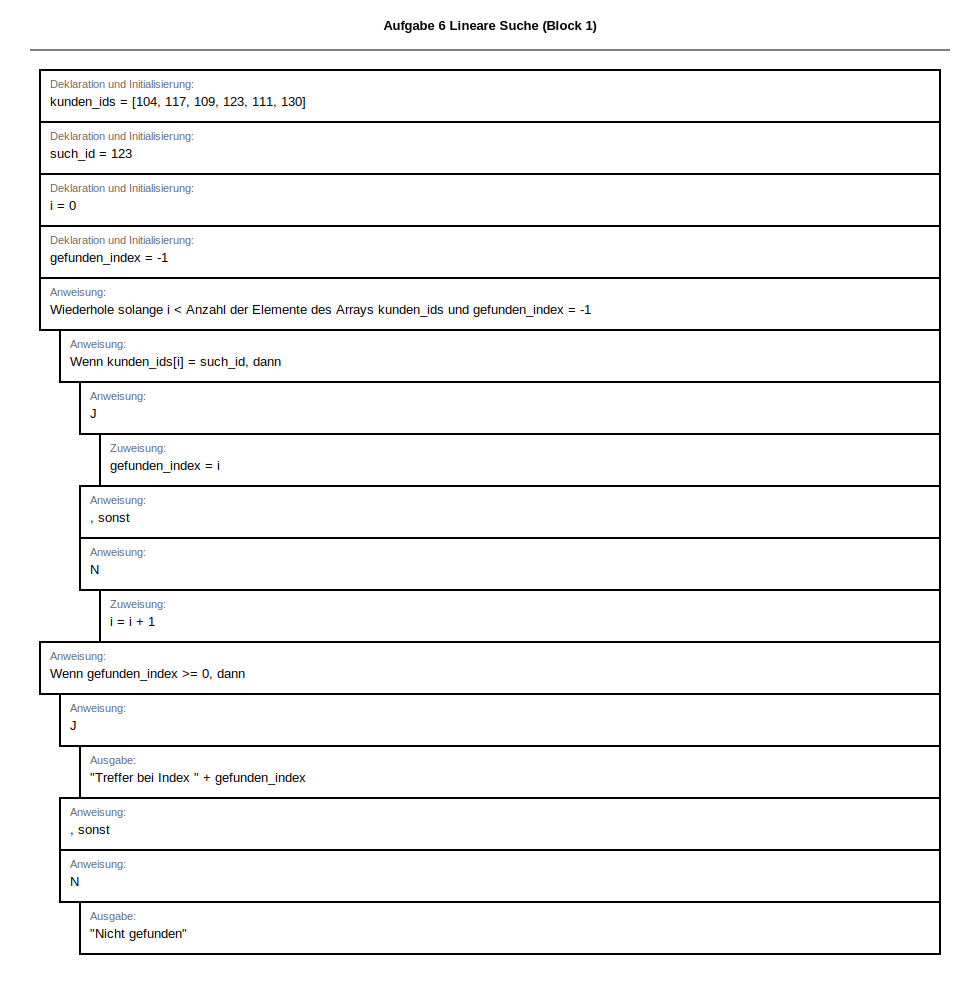

# Musterlösung & Erwartungshorizont
<!-- DOCX-CODE-STYLING: bg=#F2F2F2, text=#111111, border=#C8C8C8 -->
## Klassenarbeit:  Algorithmen und Datenstrukturen
<!-- DOCX-FUSSZEILE: Version 3 -->

**Dokumentation für Lehrkräfte**

**DOCX-Layoutvorgabe (Quellcode):** Alle Python-Quellcodelösungen sind als kopierbare Codeblöcke in einer hellgrauen Box auszugeben (Hintergrund `#F2F2F2`, Schrift `#111111`, Rahmen `#C8C8C8`).

Bezug: [docs/lehrplan/BPE5_Grundlagen_Programmierung.md](../lehrplan/BPE5_Grundlagen_Programmierung.md) und [docs/lehrplan/BPE7_Algorithmen_Datenstrukturen.md](../lehrplan/BPE7_Algorithmen_Datenstrukturen.md)

SVG-Basis: BW-Formvorlagen aus `apps/drawio-extension/stencil.xml`.

---

## 📌 Übersicht Erwartungshorizont

| Aufgabe | Punkte | Lösungstyp | Kritisch |
|---------|--------|-----------|----------|
| 1 | 3 | Struktogramm + Code | Bedingung korrekt |
| 2 | 3 | Struktogramm + Code | Schleifenabbruch |
| 3 | 3 | Grundlagen Arrays | Indexverständnis |
| 4 | 6 | Array-Algorithmen | Filter + neue Liste |
| 5 | 8 | Fehleranalyse | Ursache + Wirkung |
| 6 | 7 | Lineare Suche | Trefferlogik + Index |
| **Summe** | **30** | — | — |

---

## ✅ MUSTERLÖSUNGEN MIT BEWERTUNG

### Aufgabe 1: Verzweigung & Logik (3 Punkte)

**Aufgabenstellung (aus Prüfungsblatt):**
> **Thema:** BPE 5.2 – Kontrollstrukturen (Alternativen)
>
> Schreibe ein Struktogramm und implementiere in Python:
> > Ein Programm liest eine Ganzzahl `alter` ein und gibt aus:
> > - „Volljährig" wenn `alter >= 18`
> > - „Minderjährig" wenn `alter < 18`
>
> **Anforderungen:**
> - Struktogramm mit korrektem Aufbau (3 Punkte)
> - Eingabe darstellen
> - Verzweigung mit Bedingung
> - Ausgaben korrekt positioniert


<!-- DOCX-ALT-TEXT: L2_VarB_Aufgabe1_Volljaehrig -->
<!-- DOCX-EMBED-SVG: ../../struktogramme/generated/svg/L2_VarB_Aufgabe1_Volljaehrig.svg -->
<!-- DOCX-EMBEDDING-HINT: Dieses Struktogramm wird bei DOCX-Export als eingebettete Grafik dargestellt für bessere Kopierbarkeit und Formatierung. -->

```struktogramm
Deklaration und Einlesen: alter als Ganzzahl
Wenn alter >= 18, dann
    J
        Ausgabe: "Volljährig"
    , sonst
    N
        Ausgabe: "Minderjährig"
```

```python
def loese_aufgabe1_volljaehrig() -> None:
    alter = int(input("Alter: "))
    if alter >= 18:
        print("Volljährig")
    else:
        print("Minderjährig")
```

---

### Aufgabe 2: Schleife mit Bedingung (3 Punkte)

**Aufgabenstellung (aus Prüfungsblatt):**
> **Thema:** BPE 5.2 – Schleifen & Bedingungen
>
> Schreibe ein Struktogramm und implementiere:
> > Ein Programm liest Ganzzahlen ein und führt eine laufende Summe.
> > Das Programm endet bei `-1`.
> > Nach jeder gültigen Eingabe wird die aktuelle Summe ausgegeben.
>
> **Beispiel:**


<!-- DOCX-ALT-TEXT: L2_VarB_Aufgabe2_Laufende_Summe -->
<!-- DOCX-EMBED-SVG: ../../struktogramme/generated/svg/L2_VarB_Aufgabe2_Laufende_Summe.svg -->
<!-- DOCX-EMBEDDING-HINT: Dieses Struktogramm wird bei DOCX-Export als eingebettete Grafik dargestellt für bessere Kopierbarkeit und Formatierung. -->

```struktogramm
Deklaration und Initialisierung: summe = 0
Deklaration und Einlesen: zahl als Ganzzahl
Wiederhole solange zahl != -1
    Zuweisung: summe = summe + zahl
    Ausgabe: summe
    Deklaration und Einlesen: zahl als Ganzzahl
Ausgabe: "Programm endet"
```

```python
def loese_aufgabe2_laufende_summe() -> None:
    summe = 0
    zahl = int(input("Zahl (-1 Ende): "))
    while zahl != -1:
        summe += zahl
        print(f"Summe: {summe}")
        zahl = int(input("Zahl (-1 Ende): "))
    print("Programm endet")
```

---

### Aufgabe 3: Array-/Listen-Grundlagen (3 Punkte)

**Aufgabenstellung (aus Prüfungsblatt):**
> **Thema:** BPE 7.1 – Arrays (Deklaration, Initialisierung, Zugriff)
>
> Gegeben: `lager = [4, 7, 2, 9, 5, 1, 8, 3]`

**a)**

<!-- DOCX-ALT-TEXT: L2_3a_Aufgabe3_Array_Deklaration -->
<!-- DOCX-EMBED-SVG: ../../struktogramme/generated/svg/L2_3a_Aufgabe3_Array_Deklaration.svg -->
<!-- DOCX-EMBEDDING-HINT: Dieses Struktogramm wird bei DOCX-Export als eingebettete Grafik dargestellt für bessere Kopierbarkeit und Formatierung. -->

```python
lager = [4, 7, 2, 9, 5, 1, 8, 3]
```

**b)**

<!-- DOCX-ALT-TEXT: L2_3b_Aufgabe3_Array_Zugriff -->
<!-- DOCX-EMBED-SVG: ../../struktogramme/generated/svg/L2_3b_Aufgabe3_Array_Zugriff.svg -->
<!-- DOCX-EMBEDDING-HINT: Dieses Struktogramm wird bei DOCX-Export als eingebettete Grafik dargestellt für bessere Kopierbarkeit und Formatierung. -->

```python
erstes = lager[0]
lager[-1] = 10
laenge = len(lager)
print(erstes, laenge)
```

**c)**
`lager[5]` = 6. Element, hier Wert `1`.

---

### Aufgabe 4: Array durchlaufen & filtern (6 Punkte)

**Aufgabenstellung (aus Prüfungsblatt):**
> **Thema:** BPE 7.1 – Schleife über Arrays
>
> Gegeben: `werte = [6, 17, 24, 31, 42, 55, 68, 73]`

**a) Alle Werte ausgeben (2):**

<!-- DOCX-ALT-TEXT: L2_4a_Aufgabe4_Array_Ausgeben_Index -->
<!-- DOCX-EMBED-SVG: ../../struktogramme/generated/svg/L2_4a_Aufgabe4_Array_Ausgeben_Index.svg -->
<!-- DOCX-EMBEDDING-HINT: Dieses Struktogramm wird bei DOCX-Export als eingebettete Grafik dargestellt für bessere Kopierbarkeit und Formatierung. -->

```python
for wert in werte:
    print(wert)
```

**b) Nur gerade Werte (2):**

<!-- DOCX-ALT-TEXT: L2_4b_Aufgabe4_Array_Filtern -->
<!-- DOCX-EMBED-SVG: ../../struktogramme/generated/svg/L2_4b_Aufgabe4_Array_Filtern.svg -->
<!-- DOCX-EMBEDDING-HINT: Dieses Struktogramm wird bei DOCX-Export als eingebettete Grafik dargestellt für bessere Kopierbarkeit und Formatierung. -->

```python
for wert in werte:
    if wert % 2 == 0:
        print(wert)
```

**c) Liste halbiert (2):**

<!-- DOCX-ALT-TEXT: L2_4c1_Aufgabe4_Array_Verdoppeln_Neue_Liste -->
<!-- DOCX-EMBED-SVG: ../../struktogramme/generated/svg/L2_4c1_Aufgabe4_Array_Verdoppeln_Neue_Liste.svg -->
<!-- DOCX-EMBEDDING-HINT: Dieses Struktogramm wird bei DOCX-Export als eingebettete Grafik dargestellt für bessere Kopierbarkeit und Formatierung. -->

```python
halbiert: list[int] = []
for wert in werte:
    halbiert.append(wert // 2)
print(halbiert)
```

---

### Aufgabe 5: Algorithmen prüfen (8 Punkte)

**Aufgabenstellung (aus Prüfungsblatt):**
> **Thema:** BPE 7.2 – Algorithmenanalyse
>
> Gegeben: `werte = [29, 14, 37, 10, 18]`
>
> Das folgende Struktogramm wurde mit der BW-Operatorenliste (Draw.io-Library) entworfen und enthält **einen häufigen logischen Fehler** in einem Sortieralgorithmus.
>
> 
> <!-- DOCX-ALT-TEXT: L2_5_Aufgabe5_Algorithmen_pruefen_Fehleranalyse -->
> <!-- DOCX-EMBED-SVG: ../../struktogramme/generated/svg/L2_5_Aufgabe5_Selection_Sort_Fehleranalyse.svg -->
> <!-- DOCX-EMBEDDING-HINT: Dieses Struktogramm wird bei DOCX-Export als eingebettete Grafik dargestellt für bessere Kopierbarkeit und Formatierung. -->
>
> Bearbeite die Teilaufgaben in dieser Reihenfolge:


<!-- DOCX-ALT-TEXT: L2_5_Aufgabe5_Selection_Sort_Fehleranalyse -->
<!-- DOCX-EMBED-SVG: ../../struktogramme/generated/svg/L2_5_Aufgabe5_Selection_Sort_Fehleranalyse.svg -->
<!-- DOCX-EMBEDDING-HINT: Dieses Struktogramm wird bei DOCX-Export als eingebettete Grafik dargestellt für bessere Kopierbarkeit und Formatierung. -->

- **a) Zweck (3):** Selection Sort aufsteigend: in jedem Durchlauf das Minimum im Restfeld finden und an Position `i` tauschen.
- **b) Fehler (3):** Die Vergleichsbedingung ist invertiert (`werte[j] > werte[min_index]` statt `<`). Dadurch wird das Maximum gewählt und die Reihenfolge wird nicht aufsteigend sortiert.
- **c) Korrektur (2):**
```struktogramm
Wenn werte[j] < werte[min_index], dann
    J
        Zuweisung: min_index = j
    , sonst
    N
        [keine Anweisung]
```

---

### Aufgabe 6: Lineare Suche implementieren (7 Punkte)

**Aufgabenstellung (aus Prüfungsblatt):**
> **Thema:** BPE 7.2 – Suchalgorithmen (Lineare Suche)
>
> Gegeben: `kunden_ids = [104, 117, 109, 123, 111, 130]` und `such_id = 123`
>
> Schreibe ein Struktogramm und implementiere eine **Lineare Suche**, die den Index der gesuchten ID bestimmt.

**a) Struktogramm (3):**


<!-- DOCX-ALT-TEXT: L2_6_Aufgabe6_Lineare_Suche -->
<!-- DOCX-EMBED-SVG: ../../struktogramme/generated/svg/l2_6_aufgabe6_lineare_suche_block_01.svg -->
<!-- DOCX-EMBEDDING-HINT: Dieses Struktogramm wird bei DOCX-Export als eingebettete Grafik dargestellt für bessere Kopierbarkeit und Formatierung. -->

**BW-Notation (Operatorenliste v2.2):**
```struktogramm
Deklaration und Initialisierung: kunden_ids = [104, 117, 109, 123, 111, 130]
Deklaration und Initialisierung: such_id = 123
Deklaration und Initialisierung: i = 0
Deklaration und Initialisierung: gefunden_index = -1
Wiederhole solange i < Anzahl der Elemente des Arrays kunden_ids AND gefunden_index == -1
    Wenn kunden_ids[i] == such_id, dann
        J
            Zuweisung: gefunden_index = i
    , sonst
    N
        Zuweisung: i = i + 1
Wenn gefunden_index >= 0, dann
    J
        Ausgabe: "Treffer bei Index " + gefunden_index
    , sonst
    N
        Ausgabe: "Nicht gefunden"
```

**b) Python (3):**
```python
def loese_aufgabe6_lineare_suche(kunden_ids: list[int], such_id: int) -> int:
    for index in range(len(kunden_ids)):
        if kunden_ids[index] == such_id:
            return index
    return -1


treffer_index = loese_aufgabe6_lineare_suche([104, 117, 109, 123, 111, 130], 123)
if treffer_index >= 0:
    print(f"Treffer bei Index {treffer_index}")
else:
    print("Nicht gefunden")
```

**c) Ausgabe (1):**
`Treffer bei Index 3`

---

## ⚠️ Korrekturhinweise

- Teilpunkte bei korrekter Schleifenstruktur vergeben.
- Bei Aufgabe 6 ist `if kunden_ids[index] == such_id` die zentrale Bedingung.
- Bei Aufgabe 5 reicht ein präziser, korrekter Fehlerhinweis für hohe Teilpunktzahl.

---

