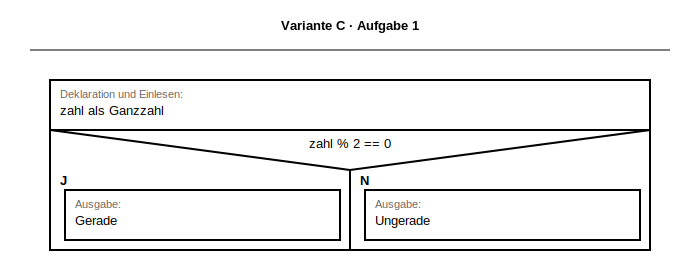
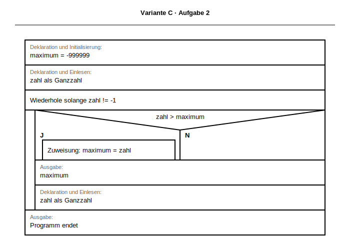
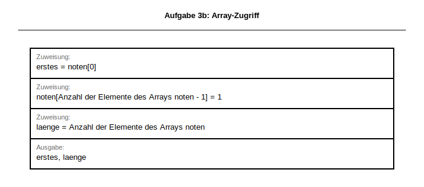
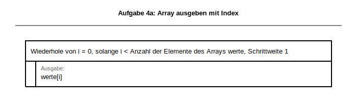
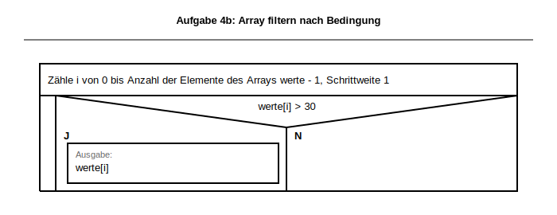
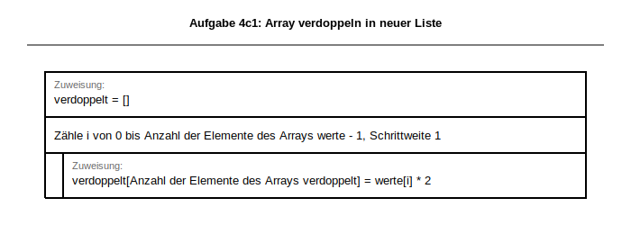

# Musterlösung & Erwartungshorizont
<!-- DOCX-CODE-STYLING: bg=#F2F2F2, text=#111111, border=#C8C8C8 -->
## Klassenarbeit:  Algorithmen und Datenstrukturen
<!-- DOCX-FUSSZEILE: Version 4 -->

**Dokumentation für Lehrkräfte**

**DOCX-Layoutvorgabe (Quellcode):** Alle Python-Quellcodelösungen sind als kopierbare Codeblöcke in einer hellgrauen Box auszugeben (Hintergrund `#F2F2F2`, Schrift `#111111`, Rahmen `#C8C8C8`).

Bezug: [docs/lehrplan/BPE5_Grundlagen_Programmierung.md](../lehrplan/BPE5_Grundlagen_Programmierung.md) und [docs/lehrplan/BPE7_Algorithmen_Datenstrukturen.md](../lehrplan/BPE7_Algorithmen_Datenstrukturen.md)

SVG-Basis: BW-Formvorlagen aus `apps/drawio-extension/stencil.xml`.

---

## 📌 Bewertungstabelle

| Aufgabe | Punkte | Schwerpunkt |
|---------|--------|-------------|
| 1 | 3 | Alternative (gerade/ungerade) |
| 2 | 3 | Schleife + Maximum |
| 3 | 3 | Array-Zugriff |
| 4 | 6 | Durchlaufen, Filtern, Transformieren |
| 5 | 8 | Fehleranalyse Algorithmus |
| 6 | 7 | Selection Sort |
| **Summe** | **30** | — |

---

## ✅ MUSTERLÖSUNGEN

### Aufgabe 1: Verzweigung & Logik (3 Punkte)

**Aufgabenstellung (aus Prüfungsblatt):**
> **Thema:** BPE 5.2 – Kontrollstrukturen (Alternativen)
>
> Schreibe ein Struktogramm und implementiere in Python:
> > Ein Programm liest eine Ganzzahl `zahl` ein und gibt aus:
> > - „Gerade" wenn `zahl % 2 == 0`
> > - „Ungerade" sonst
>
> **Anforderungen:**
> - Struktogramm mit korrektem Aufbau (3 Punkte)
> - Eingabe darstellen
> - Verzweigung mit Bedingung
> - Ausgaben korrekt positioniert


<!-- DOCX-ALT-TEXT: L2_VarC_Aufgabe1_Gerade_Ungerade -->
<!-- DOCX-EMBED-SVG: ../../archiv/struktogramme/generated/svg/L2_VarC_Aufgabe1_Gerade_Ungerade.svg -->
<!-- DOCX-EMBEDDING-HINT: Dieses Struktogramm wird bei DOCX-Export als eingebettete Grafik dargestellt für bessere Kopierbarkeit und Formatierung. -->

```struktogramm
Deklaration und Einlesen: zahl als Ganzzahl
Wenn zahl % 2 == 0, dann
    J
        Ausgabe: "Gerade"
    , sonst
    N
        Ausgabe: "Ungerade"
```

```python
def loese_aufgabe1_gerade_ungerade() -> None:
    zahl = int(input("Zahl: "))
    if zahl % 2 == 0:
        print("Gerade")
    else:
        print("Ungerade")
```

---

### Aufgabe 2: Schleife mit Bedingung (3 Punkte)

**Aufgabenstellung (aus Prüfungsblatt):**
> **Thema:** BPE 5.2 – Schleifen & Bedingungen
>
> Schreibe ein Struktogramm und implementiere:
> > Ein Programm liest Ganzzahlen ein, **solange** der Nutzer möchte.
> > Das Programm endet bei Eingabe `-1`.
> > Nach jeder gültigen Eingabe soll die bisherige **größte Zahl** ausgegeben werden.
>
> **Beispiel:**


<!-- DOCX-ALT-TEXT: L2_VarC_Aufgabe2_Maximum -->
<!-- DOCX-EMBED-SVG: ../../archiv/struktogramme/generated/svg/L2_VarC_Aufgabe2_Maximum.svg -->
<!-- DOCX-EMBEDDING-HINT: Dieses Struktogramm wird bei DOCX-Export als eingebettete Grafik dargestellt für bessere Kopierbarkeit und Formatierung. -->

```struktogramm
Deklaration und Initialisierung: maximum = -999999
Deklaration und Einlesen: zahl als Ganzzahl
Wiederhole solange zahl != -1
    Wenn zahl > maximum, dann
        J
            Zuweisung: maximum = zahl
        , sonst
        N
            [keine Anweisung]
    Ausgabe: maximum
    Deklaration und Einlesen: zahl als Ganzzahl
Ausgabe: "Programm endet"
```

```python
def loese_aufgabe2_maximum() -> None:
    maximum = -999999
    zahl = int(input("Zahl (-1 Ende): "))

    while zahl != -1:
        if zahl > maximum:
            maximum = zahl
        print(f"Maximum: {maximum}")
        zahl = int(input("Zahl (-1 Ende): "))

    print("Programm endet")
```

---

### Aufgabe 3: Array-/Listen-Grundlagen (3 Punkte)

**Aufgabenstellung (aus Prüfungsblatt):**
> **Thema:** BPE 7.1 – Arrays (Deklaration, Initialisierung, Zugriff)
>
> Gegeben: `noten = [2, 3, 1, 4, 2, 5, 3, 1]`

**a)**

<!-- DOCX-ALT-TEXT: L2_3a_Aufgabe3_Array_Deklaration -->
<!-- DOCX-EMBED-SVG: ../../archiv/struktogramme/generated/svg/L2_3a_Aufgabe3_Array_Deklaration.svg -->
<!-- DOCX-EMBEDDING-HINT: Dieses Struktogramm wird bei DOCX-Export als eingebettete Grafik dargestellt für bessere Kopierbarkeit und Formatierung. -->

```python
noten = [2, 3, 1, 4, 2, 5, 3, 1]
```

**b)**

<!-- DOCX-ALT-TEXT: L2_3b_Aufgabe3_Array_Zugriff -->
<!-- DOCX-EMBED-SVG: ../../archiv/struktogramme/generated/svg/L2_3b_Aufgabe3_Array_Zugriff.svg -->
<!-- DOCX-EMBEDDING-HINT: Dieses Struktogramm wird bei DOCX-Export als eingebettete Grafik dargestellt für bessere Kopierbarkeit und Formatierung. -->

```python
drittes = noten[2]
noten[0] = 1
laenge = len(noten)
print(drittes, laenge)
```

**c)**
`noten[6]` bedeutet: 7. Element, Wert `3`.

---

### Aufgabe 4: Array durchlaufen & filtern (6 Punkte)

**Aufgabenstellung (aus Prüfungsblatt):**
> **Thema:** BPE 7.1 – Schleife über Arrays
>
> Gegeben: `werte = [11, 28, 35, 40, 53, 64, 79, 82]`

Gegeben: `werte = [11, 28, 35, 40, 53, 64, 79, 82]`

**a)**

<!-- DOCX-ALT-TEXT: L2_4a_Aufgabe4_Array_Ausgeben_Index -->
<!-- DOCX-EMBED-SVG: ../../archiv/struktogramme/generated/svg/L2_4a_Aufgabe4_Array_Ausgeben_Index.svg -->
<!-- DOCX-EMBEDDING-HINT: Dieses Struktogramm wird bei DOCX-Export als eingebettete Grafik dargestellt für bessere Kopierbarkeit und Formatierung. -->

```python
for wert in werte:
    print(wert)
```

**b)**

<!-- DOCX-ALT-TEXT: L2_4b_Aufgabe4_Array_Filtern -->
<!-- DOCX-EMBED-SVG: ../../archiv/struktogramme/generated/svg/L2_4b_Aufgabe4_Array_Filtern.svg -->
<!-- DOCX-EMBEDDING-HINT: Dieses Struktogramm wird bei DOCX-Export als eingebettete Grafik dargestellt für bessere Kopierbarkeit und Formatierung. -->

```python
for wert in werte:
    if wert >= 40:
        print(wert)
```

**c)**

<!-- DOCX-ALT-TEXT: L2_4c1_Aufgabe4_Array_Verdoppeln_Neue_Liste -->
<!-- DOCX-EMBED-SVG: ../../archiv/struktogramme/generated/svg/L2_4c1_Aufgabe4_Array_Verdoppeln_Neue_Liste.svg -->
<!-- DOCX-EMBEDDING-HINT: Dieses Struktogramm wird bei DOCX-Export als eingebettete Grafik dargestellt für bessere Kopierbarkeit und Formatierung. -->

```python
quadriert: list[int] = []
for wert in werte:
    quadriert.append(wert * wert)
print(quadriert)
```

---

### Aufgabe 5: Algorithmen prüfen (8 Punkte)

**Aufgabenstellung (aus Prüfungsblatt):**
> **Thema:** BPE 7.2 – Algorithmenanalyse
>
> Gegeben: `buchstaben = ['H', 'I', 'N', 'W', 'E', 'I', 'S']`
>
> Das folgende Struktogramm wurde mit der BW-Operatorenliste (Draw.io-Library) entworfen und enthält **einen häufigen logischen Fehler**.
>
> 
> <!-- DOCX-ALT-TEXT: L2_5_Aufgabe5_Algorithmen_pruefen_Fehleranalyse -->
> <!-- DOCX-EMBED-SVG: ../../archiv/struktogramme/generated/svg/L2_5_Aufgabe5_Algorithmen_pruefen_Fehleranalyse.svg -->
> <!-- DOCX-EMBEDDING-HINT: Dieses Struktogramm wird bei DOCX-Export als eingebettete Grafik dargestellt für bessere Kopierbarkeit und Formatierung. -->
>
> Bearbeite die Teilaufgaben in dieser Reihenfolge:


<!-- DOCX-ALT-TEXT: L2_5_Aufgabe5_Algorithmen_pruefen_Fehleranalyse -->
<!-- DOCX-EMBED-SVG: ../../archiv/struktogramme/generated/svg/L2_5_Aufgabe5_Algorithmen_pruefen_Fehleranalyse.svg -->
<!-- DOCX-EMBEDDING-HINT: Dieses Struktogramm wird bei DOCX-Export als eingebettete Grafik dargestellt für bessere Kopierbarkeit und Formatierung. -->

**a) Zweck (3):**
Lineare Suche in der Zeichenliste nach Eingabe.

**b) Fehler (3):**
Fehlende Indexerhöhung im Nein-Zweig → dasselbe Element wird wiederholt geprüft.

**c) Korrektur (2):**
```struktogramm
Zuweisung: i = i + 1
```

---

### Aufgabe 6: Selection Sort implementieren (7 Punkte)

**Aufgabenstellung (aus Prüfungsblatt):**
> **Thema:** BPE 7.2 – Sortieralgorithmen (Selection Sort)
>
> Gegeben: `zahlen = [33, 12, 27, 5, 18]`
>
> Schreibe ein Struktogramm und implementiere **Selection Sort aufsteigend**.

**a) Struktogramm (3):**


<!-- DOCX-ALT-TEXT: L2_6_Aufgabe6_Selection_Sort -->
<!-- DOCX-EMBED-SVG: ../../archiv/struktogramme/generated/svg/L2_6_Aufgabe6_Selection_Sort.svg -->
<!-- DOCX-EMBEDDING-HINT: Dieses Struktogramm wird bei DOCX-Export als eingebettete Grafik dargestellt für bessere Kopierbarkeit und Formatierung. -->

**BW-Notation (Operatorenliste v2.2):**
```struktogramm
Deklaration und Initialisierung: zahlen = [33, 12, 27, 5, 18]
Deklaration und Initialisierung: n = Anzahl der Elemente des Arrays zahlen
Zähle i von 0 bis n - 2, Schrittweite 1
    Deklaration und Initialisierung: min_index = i
    Zähle j von i + 1 bis n - 1, Schrittweite 1
        Wenn zahlen[j] < zahlen[min_index], dann
            J
                Zuweisung: min_index = j
            , sonst
            N
                [keine Anweisung]
    Wenn min_index != i, dann
        J
            Deklaration und Initialisierung: temp = zahlen[i]
            Zuweisung: zahlen[i] = zahlen[min_index]
            Zuweisung: zahlen[min_index] = temp
        , sonst
        N
            [keine Anweisung]
Ausgabe: zahlen
```

**b) Python-Code (3):**
```python
def loese_aufgabe6_selection_sort(zahlen: list[int]) -> list[int]:
    sortierte = zahlen.copy()
    n = len(sortierte)

    for i in range(n - 1):
        min_index = i
        for j in range(i + 1, n):
            if sortierte[j] < sortierte[min_index]:
                min_index = j

        if min_index != i:
            temp = sortierte[i]
            sortierte[i] = sortierte[min_index]
            sortierte[min_index] = temp

    return sortierte

print(loese_aufgabe6_selection_sort([33, 12, 27, 5, 18]))
```

**c) Ausgabe (1):**
`[5, 12, 18, 27, 33]`

---

## ⚠️ Korrekturhinweise

- Teilpunkte bei korrekter Struktur vergeben.
- Aufgabe 2: Maximum muss nur bei größerem Wert aktualisiert werden.
- Aufgabe 6: Häufige Fehler sind falsche Grenzen und fehlender Tausch.

---

