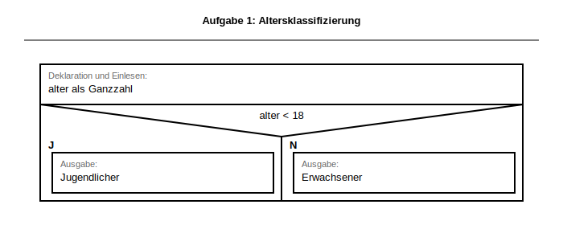
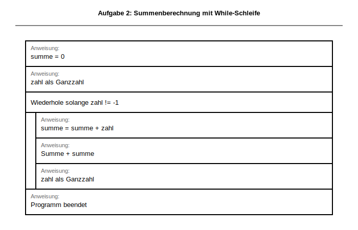
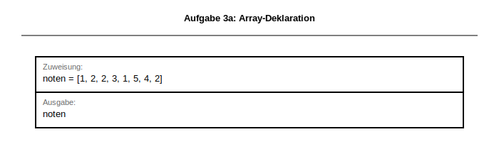
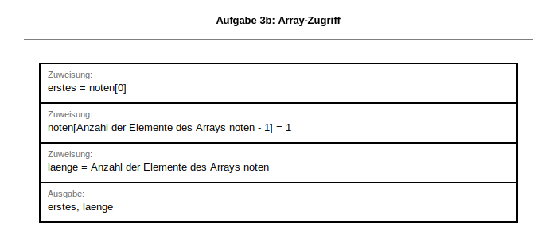
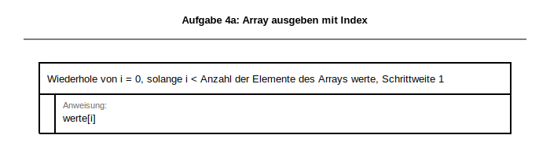
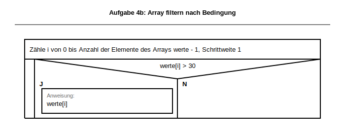
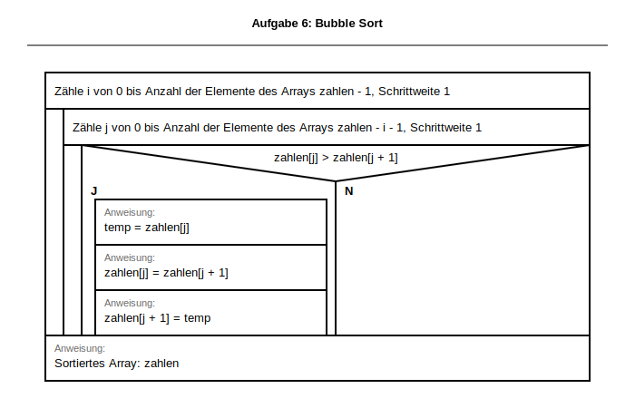

# Musterlösung & Erwartungshorizont
## Klassenarbeit: Kontrollstrukturen, Arrays (Listen) und Algorithmen

**Dokumentation für Lehrkräfte**

Grundlage: Inhalte aus [src/niveau/infodateien/L2_1 Information_Algorithmik.docx](src/niveau/infodateien/L2_1%20Information_Algorithmik.docx), [src/niveau/infodateien/L2_2.1 Information_Bubble_Sort.docx](src/niveau/infodateien/L2_2.1%20Information_Bubble_Sort.docx), [src/niveau/infodateien/L2_2.2 Information_Selection_Sort.docx](src/niveau/infodateien/L2_2.2%20Information_Selection_Sort.docx), [src/niveau/infodateien/L2_3.1 Information_Lineare_Suche.docx](src/niveau/infodateien/L2_3.1%20Information_Lineare_Suche.docx), [src/niveau/infodateien/L2_3.2 Information_Binäre_Suche.docx](src/niveau/infodateien/L2_3.2%20Information_Bin%C3%A4re_Suche.docx).

---

## 📌 Übersicht Erwartungshorizont

| Aufgabe | Punkte | Lösungstyp | Bewertung |
|---------|--------|-----------|----------|
| 1 | 3 | Struktogramm + Code | Syntaxfehler -1 Punkt |
| 2 | 3 | Struktogramm + Code | Logikfehler -1 bis -2 Punkte |
| 3 | 3 | Code + Interpretation | Jeder fehlerhafte Teil -1 Punkt |
| 4 | 6 | Struktogramm + Code (3 Varianten) | Pro Teilaufgabe -1 bis -2 Punkte |
| 5 | 8 | Struktogramm-Analyse + Fehlerdiagnose | Kritisch: Fehlerursache korrekt erkannt |
| 6 | 7 | Struktogramm + Code + Ausgabe | Swap-Logik ist kritisch |
| **Summe** | **30** | — | — |

---

## ✅ MUSTERLÖSUNGEN MIT BEWERTUNG

### **Aufgabe 1: Verzweigung & Logik (3 Punkte)**

**Aufgabenstellung (aus Prüfungsblatt):**
> Ein Programm liest eine Ganzzahl (Alter) ein und gibt aus:
> - „Jugendlicher" wenn das Alter < 18 ist
> - „Erwachsener" wenn das Alter >= 18 ist

**Erwartetes Struktogramm (BW-Standard - Grafische Notation):**



**Python-Code (Musterlösung):**
```python
def loese_aufgabe1_altersklassifikation() -> None:
    alter = int(input("Geben Sie Ihr Alter ein: "))
    if alter < 18:
        print("Jugendlicher")
    else:
        print("Erwachsener")


# Test: Funktions-/Methodenaufruf
loese_aufgabe1_altersklassifikation()
```

**Bewertung (3 Punkte):**
- ✅ **Struktogramm korrekt formatiert** (1 Punkt)
  - Eingabe oben
  - Raute mit Bedingung
  - Beide Ausgaben sichtbar
- ✅ **Python-Code syntaktisch korrekt** (1 Punkt)
  - `int(input(...))` korrekt
  - Bedingung richtig
- ✅ **Logik funktioniert** (1 Punkt)

**Häufige Fehler & Punkteabzug:**

| Fehler | Abzug |
|--------|-------|
| Struktogramm mit Pfeilen statt Symbolen | -0,5 Punkte |
| `if alter <= 18` statt `< 18` | -0,5 Punkte |
| Fehlende Ausgabe/print() | -1 Punkt |
| Syntaxfehler (z. B. `:` vergessen) | -1 Punkt |

---

### **Aufgabe 2: Schleife mit Bedingung (3 Punkte)**

**Aufgabenstellung (aus Prüfungsblatt):**
> Ein Programm liest positive Ganzzahlen ein, **solange** der Nutzer möchte.
> Nach jeder Eingabe wird die **Summe aller bisherigen Zahlen** ausgegeben.
> Das Programm endet, wenn die Eingabe **-1** ist.

**Erwartetes Struktogramm (BW-Standard - Grafische Notation):**



**Python-Code (Musterlösung):**
```python
def loese_aufgabe2_summe_bis_abbruch() -> None:
    summe = 0
    zahl = int(input("Geben Sie eine Zahl ein (oder -1 zum Beenden): "))

    while zahl != -1:
        summe = summe + zahl
        print(f"Summe: {summe}")
        zahl = int(input("Geben Sie eine Zahl ein (oder -1 zum Beenden): "))

    print("Programm beendet.")


# Test: Funktions-/Methodenaufruf
loese_aufgabe2_summe_bis_abbruch()
```

**Bewertung (3 Punkte):**
- ✅ **Struktogramm korrekt** (2 Punkte)
  - Initalisierung erkennbar (summe = 0)
  - while-Schleife mit Bedingung
  - Schleifenkörper mit Summe-Update und Ausgabe
  - Schleife wiederholt Eingabe
- ✅ **Python-Code funktionsfähig** (1 Punkt)
  - `while` mit korrekter Bedingung
  - Summe wird aktualisiert

**Häufige Fehler & Punkteabzug:**

| Fehler / Variante | Abzug |
|-----------|-------|
| for-Schleife statt while (nicht flexibel) | -1 Punkt |
| Bedingung falsch (`zahl == -1`) | -1 Punkt |
| Summe wird nicht initialisiert | -0,5 Punkte |
| Print nicht in Schleife | -0,5 Punkte |
| Eingabe wird nur einmal gelesen | -1 Punkt |

**Alternative Akzeptabel:**


```python
def loese_aufgabe2_summe_mit_break() -> None:
    summe = 0
    while True:
        zahl = int(input("Zahl: "))
        if zahl == -1:
            break
        summe += zahl
        print(f"Summe: {summe}")


# Test: Funktions-/Methodenaufruf
loese_aufgabe2_summe_mit_break()
```
→ Volle Punkte (alternative Kontrollflussvariante)

---

### **Aufgabe 3: Array (Liste)-Grundlagen (3 Punkte)**

**Aufgabenstellung (aus Prüfungsblatt):**
> a) Array (Liste) deklarieren und initialisieren: `Noten = [1, 2, 2, 3, 1, 5, 4, 2]`
> b) 1. Element auslesen, letztes Element auf `1` setzen, Länge ausgeben
> c) Bedeutung von `noten[3]` erklären

**a) Deklaration (1 Punkt)**

**Musterlösung:**



```python
def loese_aufgabe3a_deklaration() -> list[int]:
    noten = [1, 2, 2, 3, 1, 5, 4, 2]
    return noten


# Test: Funktions-/Methodenaufruf
print(loese_aufgabe3a_deklaration())
```

**Bewertung:**
- ✅ Exakte oder äquivalente Syntax = 1 Punkt
- ❌ Fehler (z. B. `noten [1, 2, ...]` oder `noten = {1,2,...}`) = 0 Punkte

---

**b) Array (Liste)-Zugriff (1 Punkt)**

**Musterlösung:**



```python
def loese_aufgabe3b_array_zugriff() -> None:
    noten = [1, 2, 2, 3, 1, 5, 4, 2]
    erstes = noten[0]          # 1. Element = 1
    noten[-1] = 1              # Letztes Element auf 1 setzen
    laenge = len(noten)        # Länge = 8
    print(erstes, laenge)


# Test: Funktions-/Methodenaufruf
loese_aufgabe3b_array_zugriff()
```

**Bewertung (1 Punkt, alles oder nichts):**
- ✅ `noten[0]` (oder `noten[1]` als "1. Position") = 0,3 Punkte
- ✅ `noten[-1] = 1` (oder `noten[7] = 1`) = 0,3 Punkte
- ✅ `len(noten)` = 0,3 Punkte
- ❌ Syntaxfehler in einem Punkt = -0,5

---

**c) Interpretation (1 Punkt)**

**Musterlösung:**
```
noten[3] = 3 (das Element an Index 3 = 4. Position = Note 3)
```

**Alternativ akzeptabel:**
```
Das 4. Element des Arrays (Listen), dessen Wert 3 ist.
```

**Bewertung:**
- ✅ Korrekte Interpretation (Index 3 = 4. Position) = 1 Punkt
- ⚠️ Nur Wertangabe ohne Index-Erklärung = 0,5 Punkte
- ❌ Falsche Interpretation = 0 Punkte

---

### **Aufgabe 4: Array (Liste) durchlaufen & filtern (6 Punkte)**

**Aufgabenstellung (aus Prüfungsblatt):**
> Gegeben ist das Array (Liste): `werte = [12, 45, 23, 67, 8, 34, 56, 11]`
> a) Alle Werte zeilenweise ausgeben
> b) Nur Werte > 30 ausgeben
> c) Jedes Element verdoppeln und in einem neuen Array (Liste) speichern

**Gegeben:** `werte = [12, 45, 23, 67, 8, 34, 56, 11]`

---

**a) Alle Werte ausgeben (2 Punkte)**

**Struktogramm (1 Punkt):**



**Python-Code (1 Punkt):**

**Musterlösung (for-Schleife mit Index):**
```python
def loese_aufgabe4a_werte_ausgeben_index(werte: list[int]) -> None:
    for i in range(len(werte)):
        print(werte[i])


# Test: Funktions-/Methodenaufruf
loese_aufgabe4a_werte_ausgeben_index([12, 45, 23, 67, 8, 34, 56, 11])
```

**Alternative akzeptabel (for-Schleife mit Element):**
```python
def loese_aufgabe4a_werte_ausgeben_element(werte: list[int]) -> None:
    for wert in werte:
        print(wert)


# Test: Funktions-/Methodenaufruf
loese_aufgabe4a_werte_ausgeben_element([12, 45, 23, 67, 8, 34, 56, 11])
```

**Alternative akzeptabel (while-Schleife):**
```python
def loese_aufgabe4a_werte_ausgeben_while(werte: list[int]) -> None:
    i = 0
    while i < len(werte):
        print(werte[i])
        i += 1


# Test: Funktions-/Methodenaufruf
loese_aufgabe4a_werte_ausgeben_while([12, 45, 23, 67, 8, 34, 56, 11])
```

**Bewertung:**
- ✅ Jede Variante = volle 2 Punkte
- ⚠️ `print(werte)` (gibt ganzes Array (Liste) aus) = 1 Punkt
- ❌ Keine Schleife, nur Einzelausgaben = 0 Punkte

---

**b) Elemente filtern (2 Punkte)**

**Musterlösung:**




```python
def loese_aufgabe4b_filtere_groesser_30(werte: list[int]) -> None:
    for wert in werte:
        if wert > 30:
            print(wert)


# Test: Funktions-/Methodenaufruf
loese_aufgabe4b_filtere_groesser_30([12, 45, 23, 67, 8, 34, 56, 11])
```

**Alternative:**

## 📐 Struktogramm (grafische Notation)

<!-- START_GRAPHIC_STRUKTOGRAMM -->
```
┌────────────────────────────────────────┐
│ Zähle i von 0 bis Anzahl der Elemente  │
│ des Arrays (Listen) werte - 1, Schrittweite 1   │
│   Wenn werte[i] > 30, dann             │
│     J                                  │
│       Ausgabe:                         │
│       werte[i]                         │
│     , sonst                            │
│     N                                  │
│       (keine Aktion)                   │
└────────────────────────────────────────┘
```
<!-- END_GRAPHIC_STRUKTOGRAMM -->


```python
def loese_aufgabe4b_filtere_groesser_30_index(werte: list[int]) -> None:
    for i in range(len(werte)):
        if werte[i] > 30:
            print(werte[i])


# Test: Funktions-/Methodenaufruf
loese_aufgabe4b_filtere_groesser_30_index([12, 45, 23, 67, 8, 34, 56, 11])
```

**Bewertung (2 Punkte):**
- ✅ Schleife + if-Bedingung korrekt = 2 Punkte
- ⚠️ Nur Bedingung ohne Schleife = 1 Punkt
- ⚠️ Schleife aber Bedingung falsch (`if wert < 30`) = 1 Punkt
- ❌ Keine Lösung = 0 Punkte

**Erwartete Ausgabe:**
```
45
67
34
56
```

---

**c) Array (Liste) manipulieren (2 Punkte)**

**Musterlösung 1 (neue Liste mit Schleife):**

## 📐 Struktogramm (grafische Notation)

<!-- START_GRAPHIC_STRUKTOGRAMM -->
```
┌────────────────────────────────────────┐
│ Deklaration und Initialisierung:       │
│ verdoppelt = []                        │
│ Zähle i von 0 bis Anzahl der Elemente  │
│ des Arrays (Listen) werte - 1, Schrittweite 1   │
│   Zuweisung:                           │
│   verdoppelt[Anzahl der Elemente des   │
│   Arrays (Listen) verdoppelt] = werte[i] * 2    │
└────────────────────────────────────────┘
```
<!-- END_GRAPHIC_STRUKTOGRAMM -->


```python
def loese_aufgabe4c_verdoppeln_neue_liste(werte: list[int]) -> list[int]:
    verdoppelt = []
    for wert in werte:
        verdoppelt.append(wert * 2)
    return verdoppelt


# Test: Funktions-/Methodenaufruf
print(loese_aufgabe4c_verdoppeln_neue_liste([12, 45, 23, 67, 8, 34, 56, 11]))  # [24, 90, 46, 134, 16, 68, 112, 22]
```

**Musterlösung 2 (modifizieren im Original):**

## 📐 Struktogramm (grafische Notation)

<!-- START_GRAPHIC_STRUKTOGRAMM -->
```
┌────────────────────────────────────────┐
│ Zähle i von 0 bis Anzahl der Elemente  │
│ des Arrays (Listen) werte - 1, Schrittweite 1   │
│   Zuweisung:                           │
│   werte[i] = werte[i] * 2              │
└────────────────────────────────────────┘
```
<!-- END_GRAPHIC_STRUKTOGRAMM -->


```python
def loese_aufgabe4c_verdoppeln_im_original(werte: list[int]) -> list[int]:
    for i in range(len(werte)):
        werte[i] = werte[i] * 2
    return werte


# Test: Funktions-/Methodenaufruf
print(loese_aufgabe4c_verdoppeln_im_original([12, 45, 23, 67, 8, 34, 56, 11]))
```

**Bewertung (2 Punkte):**
- ✅ Schleife mit append() oder Index-Zugriff = 2 Punkte
- ⚠️ Nur Berechnung ohne Speicherung = 1 Punkt
- ❌ Falsch strukturiert = 0 Punkte

---

### **Aufgabe 5: Algorithmen prüfen (8 Punkte)**

**Aufgabenstellung (aus Prüfungsblatt):**
> Analysiere das fehlerhafte Struktogramm.
> a) Vermuteten Zweck beschreiben
> b) Logischen Fehler und Auswirkung erläutern
> c) BW-konforme Korrekturanweisung formulieren

**Gegeben:** `buchstaben = ['A', 'B', 'C', 'D', 'E', 'F', 'G']`

---

**Fehlerhaftes Struktogramm (Aufgabenmaterial):**


---

**a) Vermuteter Zweck (3 Punkte)**

**Erwartung:**
- Der Algorithmus soll eine **lineare Suche** im Array (Liste) `buchstaben` durchführen.
- Es wird ein Eingabewert eingelesen.
- Bei Treffer soll „Treffer“ ausgegeben werden, sonst „Kein Treffer“.

**Musterantwort (Beispiel):**
```
Der Algorithmus durchsucht das Array (Liste) buchstaben nacheinander nach einem eingegebenen Zeichen.
Er verwendet dazu einen Index i und eine Wiederhole-solange-Schleife.
Wenn das Zeichen gefunden wird, soll eine Fundmeldung mit Index ausgegeben werden.
Falls kein Treffer existiert, soll "Nicht gefunden" ausgegeben werden.
```

**Bewertung (3 Punkte):**
- ✅ Zweck „lineare Suche“ klar benannt = 1 Punkt
- ✅ Sequenzielles Durchlaufen/Schleife beschrieben = 1 Punkt
- ✅ Ausgabeidee (Fund/Nicht-Fund) korrekt = 1 Punkt

---

**b) Fehleranalyse (3 Punkte)**

**Erwarteter Fehler:**
- Im **Nein-Zweig** der inneren Verzweigung fehlt die Anweisung
  `Zuweisung: i = i + 1`.
- Dadurch bleibt `i` unverändert, wenn `buchstaben[i] != eingabe` ist.
- Folge: Die Schleife kann in eine **Endlosschleife** geraten (bei Nicht-Treffer am aktuellen Index).

**Musterantwort (kurz):**
```
Der Index i wird nicht erhöht, wenn das aktuelle Array (Liste)-Element nicht dem Suchwert entspricht.
Dadurch prüft der Algorithmus immer wieder dasselbe Element.
Die Wiederhole-solange-Bedingung bleibt wahr und das Programm kann hängen bleiben.
```

**Bewertung (3 Punkte):**
- ✅ Fehlerstelle korrekt lokalisiert (Nein-Zweig) = 1 Punkt
- ✅ Fehlende/falsche Anweisung korrekt benannt = 1 Punkt
- ✅ Laufzeitfolge (Endlosschleife/kein Fortschritt) korrekt erklärt = 1 Punkt

---

**c) Korrekturvorschlag (2 Punkte)**

**Erwartete BW-konforme Korrektur:**

```struktogramm
Wenn buchstaben[i] == eingabe, dann
    J
        Zuweisung: flag = wahr
    , sonst
    N
        Zuweisung: i = i + 1
```

**Alternative akzeptabel:**
- Zuweisung `i = i + 1` außerhalb der Verzweigung, sofern die Suchlogik korrekt bleibt.

**Bewertung (2 Punkte):**
- ✅ Operator-Notation korrekt = 1 Punkt
- ✅ Logikfehler tatsächlich behoben = 1 Punkt

---

### **Aufgabe 6: Bubble Sort implementieren (7 Punkte)**

**Aufgabenstellung (aus Prüfungsblatt):**
> Schreibe ein Struktogramm und implementiere **Bubble Sort** in Python.
> Verwende verschachtelte Schleifen und eine klare Tauschlogik.
> Gib das sortierte Array (Liste) aus.

**Gegeben:** `zahlen = [5, 2, 8, 1, 9]`

---

**a) Struktogramm (3 Punkte)**

**Erwartete Struktur (BW-Standard nach Operatorenliste):**

```struktogramm
Deklaration und Initialisierung: n als Ganzzahl = Anzahl der Elemente des Arrays (Listen) zahlen
Zähle i von 0 bis n - 2, Schrittweite 1
    Zähle j von 0 bis n - 2 - i, Schrittweite 1
        Wenn zahlen[j] > zahlen[j + 1], dann
            J
                Zuweisung: temp = zahlen[j]
                Zuweisung: zahlen[j] = zahlen[j + 1]
                Zuweisung: zahlen[j + 1] = temp
            , sonst
            N
                (keine Aktion)
```

**Bewertung Struktogramm (3 Punkte):**
- ✅ Äußere Schleife (for/while) (1 Punkt)
- ✅ Innere Schleife verschachtelt (1 Punkt)
- ✅ Vergleich und Tausch-Logik (1 Punkt)

**Häufige Fehler:**
| Fehler | Abzug |
|--------|-------|
| Schleifen nicht verschachtelt | -1 Punkt |
| Swap-Bedingung falsch (< statt >) | -0,5 |
| Schleifengrenzen falsch | -0,5 |
| Keine swap-Logik erkennbar | -0,75 |

---

**b) Python-Code (3 Punkte)**

**Musterlösung 1 (klassisch mit temp):**



```python
def loese_aufgabe6_bubble_sort_temp(zahlen: list[int]) -> list[int]:
    sortierte_zahlen = zahlen.copy()
    n = len(sortierte_zahlen)

    for i in range(n - 1):
        for j in range(n - 1 - i):
            if sortierte_zahlen[j] > sortierte_zahlen[j + 1]:
                temp = sortierte_zahlen[j]
                sortierte_zahlen[j] = sortierte_zahlen[j + 1]
                sortierte_zahlen[j + 1] = temp

    return sortierte_zahlen


# Test: Funktions-/Methodenaufruf
print(loese_aufgabe6_bubble_sort_temp([5, 2, 8, 1, 9]))  # [1, 2, 5, 8, 9]
```

**Musterlösung 2 (mit Python-Tuple-Swap):**

## 📐 Struktogramm (grafische Notation)

<!-- START_GRAPHIC_STRUKTOGRAMM -->
```
┌────────────────────────────────────────┐
│ Deklaration:                           │
│ n = Anzahl Elemente                    │
│ Zähle i von 0 bis n - 2, Schrittweite  │
│ 1                                      │
│   Zähle j von 0 bis n - 2 - i, Schritt │
│   weite 1                              │
│     Wenn zahlen[j] > zahlen[j + 1],    │
│     dann                               │
│       J                                │
│         Zuweisung:                     │
│         zahlen[j], zahlen[j + 1] =     │
│         zahlen[j + 1], zahlen[j]       │
│       , sonst                          │
│       N                                │
│         (keine Aktion)                 │
└────────────────────────────────────────┘
```
<!-- END_GRAPHIC_STRUKTOGRAMM -->


```python
def loese_aufgabe6_bubble_sort_tuple_swap(zahlen: list[int]) -> list[int]:
    sortierte_zahlen = zahlen.copy()

    for i in range(len(sortierte_zahlen) - 1):
        for j in range(len(sortierte_zahlen) - 1 - i):
            if sortierte_zahlen[j] > sortierte_zahlen[j + 1]:
                sortierte_zahlen[j], sortierte_zahlen[j + 1] = sortierte_zahlen[j + 1], sortierte_zahlen[j]

    return sortierte_zahlen


# Test: Funktions-/Methodenaufruf
print(loese_aufgabe6_bubble_sort_tuple_swap([5, 2, 8, 1, 9]))
```

**Bewertung (3 Punkte):**
- ✅ Verschachtelte Schleifen mit Grenzen = 1,5 Punkte
- ✅ Swap-Logik korrekt = 1 Punkt
- ✅ Syntax korrekt = 0,5 Punkte
- ⚠️ Äußere Schleife falsch (z.B. `range(n)` statt `range(n-1)`) = -0,5
- ⚠️ Swap-Bedingung falsch = -0,75
- ❌ Keine Schleifenverschachtelung = 0 Punkte

---

**c) Ausgabe (1 Punkt)**

**Musterlösung:**
```
[1, 2, 5, 8, 9]
```

oder

```
1 2 5 8 9
```

**Bewertung (1 Punkt):**
- ✅ Korrekt sortiert = 1 Punkt
- ⚠️ Falsch sortiert, aber Code logisch = 0 Punkte (Fehler im Code)
- ❌ Nicht ausgefüllt = 0 Punkte

---

## 📊 ZUSAMMENFASSUNG ERWARTUNGSHORIZONT

| Aufgabe | Maximal | Anforderungsbereich | Kritische Felder |
|---------|---------|-------------------|------------------|
| **1** | 3 | I | Struktogramm-Syntax |
| **2** | 3 | II | Schleife + Bedingung korrekt |
| **3** | 3 | I | Array (Liste)-Index, Zugriff |
| **4** | 6 | II | Schleife durchläuft korrekt |
| **5** | 8 | II/III | **Fehlerursache und Korrektur korrekt** |
| **6** | 7 | III | **Swap-Logik korrekt** |
| **Summe** | **30** | — | — |

---

## ⚠️ KORREKTURHINWEISE FÜR LEHRER

### Allgemeine Prinzipien

1. **Struktogramme:** Struktur ist wichtiger als Perfektionismus
   - Handgezeichnet OK
   - Symbole müssen erkennbar sein (nicht einfach Pfeile)

2. **Schreibtische:** Nachvollziehbarkeit zählt
   - Jeder Schritt muss lesbar sein
   - Nicht Wert nach Wert, sondern Zustandsverlauf

3. **Logik vor Syntax**
   - Minore Syntaxfehler: -0,25 bis -0,5 Punkte
   - Logikfehler: -1 bis -2 Punkte

4. **Teilpunkte vergeben** (nicht alles-oder-nichts)
   - **2-Punkte-Aufgabe:** 2 oder 1 oder 0
   - **3-Punkte-Aufgabe:** 3, 2, 1, oder 0
    - **Komplexe Aufgaben (7-8 Punkte):** Feinere Abstufung möglich

### Häufige Schüler-Fehler akzeptieren

✅ **Akzeptabel auch wenn nicht optimal:**
- `for i in range(len(array))` vs. `for element in array` – beide OK
- while-Schleife statt for-Schleife bei Arrays (Listen) – OK
- Tausch mit temp vs. Tuple-Swap – beide OK
- `if not gefunden` vs. `if gefunden == False` – beide OK
- Deutsche Variablennamen (z.B. `zaehler`) – OK

❌ **Nicht akzeptabel:**
- Struktogramm ist Flussdiagramm
- Array (Liste) wird als Dictionary behandelt: `werte = {'0': 12, '1': 45}`
- Schleife wird nicht beendet
- Swap erfolgt falsch (`zahlen[j] = zahlen[j+1]` ohne temp)
- Index Out of Range (z.B. `zahlen[j+1]` wenn `j = len(zahlen)-1`)

### Besondere Hinweise zu Aufgaben

**Aufgabe 5 (Algorithmen prüfen):**
- Der Fokus liegt auf **Algorithmusverständnis und Fehlerdiagnose**
- Teilpunkte geben, wenn Zweck korrekt erkannt wurde, auch wenn die Korrektur unvollständig ist

**Aufgabe 6 (Bubble Sort):**
- Kontrollieren Sie die Swap-Bedingung genau
- Häufiger Fehler: `if zahlen[j] < zahlen[j+1]` (falsch herum)
- Schleifengrenzen (`range(n-1-i)`) sind kritisch

### Notenfelder

Bei 30 Punkten:
- **Note 1:** 27–30 (90%)
- **Note 2:** 24–26 (80%)
- **Note 3:** 21–23 (70%)
- **Note 4:** 18–20 (60%)
- **Note 5:** 15–17 (50%)
- **Note 6:** < 15 (< 50%)

---

## 🔍 LÖSUNGSÜBERPRÜFUNG – SCHNELLE CHECKLISTE

### Aufgabe 1
- [ ] Struktogramm zeigt if-else
- [ ] Code nutzt `if` und `else`
- [ ] Bedingung ist richtig (< 18, nicht <= 18)

### Aufgabe 2
- [ ] While-Schleife mit Bedingung != -1
- [ ] summe wird initialisiert
- [ ] summe wird in Schleife aktualisiert
- [ ] Ausgabe erfolgt in Schleife

### Aufgabe 3
- [ ] Array (Liste) wird mit [ ] deklariert
- [ ] Indexing benutzt [0] für erstes Element
- [ ] len() zeigt Array (Liste)-Länge

### Aufgabe 4
- [ ] a) Schleife durchläuft alle 8 Elemente
- [ ] b) Bedingung > 30 ist erfüllt, Ausgabe: 4 Werte
- [ ] c) Neues Array (Liste) mit verdoppelten Werten

### Aufgabe 5
- [ ] Zweck des Algorithmus korrekt beschrieben (lineare Suche erkannt)
- [ ] Fehlerstelle im Nein-Zweig korrekt erkannt
- [ ] `Zuweisung: i = i + 1` als Korrektur benannt

### Aufgabe 6
- [ ] Äußere Schleife: `for i in range(n-1)`
- [ ] Innere Schleife: `for j in range(n-1-i)`
- [ ] Swap erfolgt bei `zahlen[j] > zahlen[j+1]`
- [ ] Ausgabe: [1, 2, 5, 8, 9]

---

**Version:** 1.0  
**Gültig für:** Klasse 2 (Informatik BG, 2-jährig & 3-jährig)  
**Erstellt:** 06.02.2026
