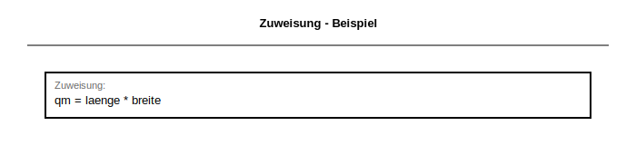
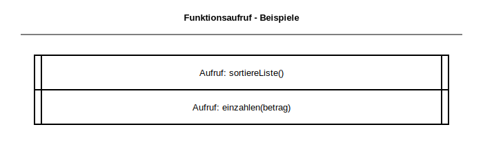
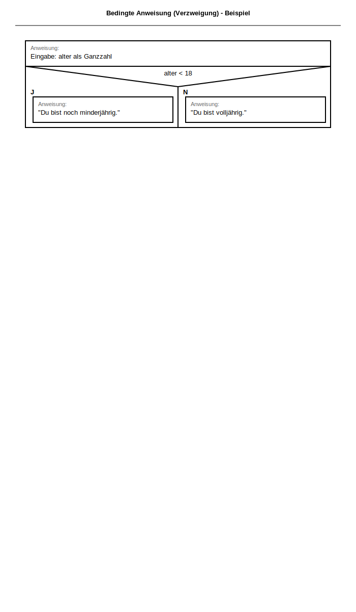
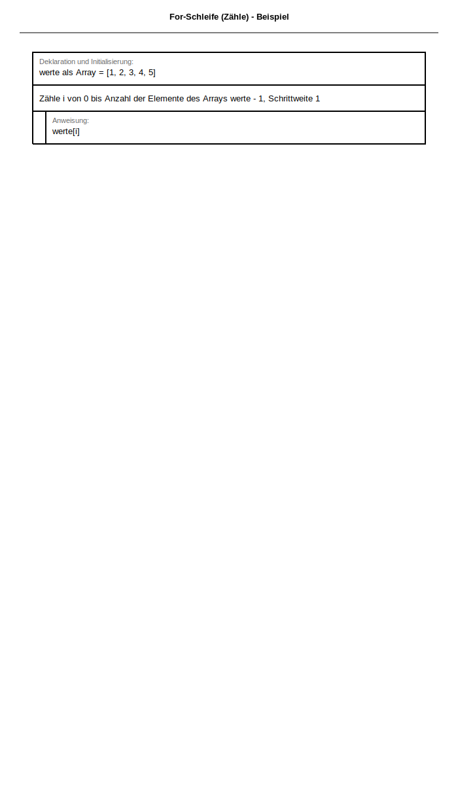
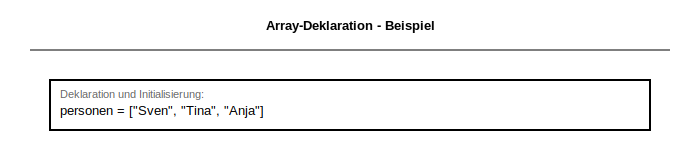
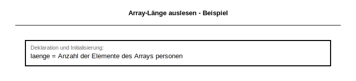

# Operatorenliste für Struktogramme

Version 2.2 vom 01.09.2024  
Abiturprüfung Baden-Württemberg

## Inhaltsverzeichnis

1. [Variablen und Datenstrukturen](#1-variablen-und-datenstrukturen)
   - 1.1 [Deklaration](#11-deklaration)
   - 1.2 [Initialisierung](#12-initialisierung)
   - 1.3 [Deklaration und Initialisierung](#13-deklaration-und-initialisierung)
   - 1.4 [Zuweisung](#14-zuweisung)

2. [Ein- und Ausgabe](#2-ein--und-ausgabe)
   - 2.1 [Einlesen](#21-einlesen)
   - 2.2 [Ausgabe](#22-ausgabe)
   - 2.3 [Zeilenweise Ausgabe](#23-zeilenweise-ausgabe)
   - 2.4 [Rückgabe](#24-rückgabe)

3. [Funktionen und Methoden](#3-funktionen-und-methoden)
   - 3.1 [Aufruf](#31-aufruf)

4. [Kontrollstrukturen](#4-kontrollstrukturen)
   - 4.1 [Bedingte Anweisung (Verzweigung)](#41-bedingte-anweisung-verzweigung)
   - 4.2 [Wiederhole-solange-Schleife (while-Schleife)](#42-wiederhole-solange-schleife-while-schleife)
   - 4.3 [Zählergesteuerte Schleife (for-Schleife)](#43-zählergesteuerte-schleife-for-schleife)

5. [Arrays](#5-arrays)
   - 5.1 [Array-Deklaration und Initialisierung](#51-array-deklaration-und-initialisierung)
   - 5.2 [Array-Element-Zuweisung](#52-array-element-zuweisung)
   - 5.3 [Anhängen an ein Array](#53-anhängen-an-ein-array)
   - 5.4 [Anzahl der Elemente eines Arrays](#54-anzahl-der-elemente-eines-arrays)
   - 5.5 [Array-Element-Ausgabe](#55-array-element-ausgabe)
   - 5.6 [Gesamten Array ausgeben](#56-gesamten-array-ausgeben)

6. [Zusammenfassung der wichtigsten Konzepte](#zusammenfassung-der-wichtigsten-konzepte)

7. [Praktische Hinweise für die Verwendung](#praktische-hinweise-für-die-verwendung)

8. [Weitere Beispiele - Verschiedene Kontrollstrukturen](#8-weitere-beispiele---verschiedene-kontrollstrukturen)

9. [Zusammenfassung - Alle Struktogramm-Formen im Überblick](#9-zusammenfassung---alle-struktogramm-formen-im-überblick)

10. [Speichern und Laden von Datensätzen](#10-speichern-und-laden-von-datensätzen-zusätzlich)

---

## Wichtige Hinweise

- **Kursive Ausdrücke** sind allgemeine Platzhalter (z. B. `variable`, `datentyp`, `wert`, `bedingung`)
- **Optionale Erweiterungen** stehen in senkrechten Strichen `| |` und können weggelassen werden
- **Kontrollstrukturen** (des gleichen oder unterschiedlichen Typs) können miteinander verschachtelt werden
- Die Notation im Struktogramm folgt einer standardisierten Form für die Abiturprüfung Baden-Württemberg

---

## 1. Variablen und Datenstrukturen

**Alle Anweisungstypen - Überblick:**


*Übersicht aller Anweisungstypen nach BW-Standard: Deklaration, Deklaration und Initialisierung, Einlesen, Deklaration und Einlesen, Zuweisung, Ausgabe, Rückgabe*

---

### 1.1 Deklaration

**Operator:** `Deklaration: variable |als datentyp|`

**Beschreibung:** Deklaration einer Variablen, optionale Angabe des Datentyps

**Zweck:** Eine Variable wird bekannt gemacht und reserviert Speicherplatz. Der Datentyp ist optional, kann aber zur besseren Lesbarkeit angegeben werden.

**Häufige Datentypen:**
- Ganzzahl (Integer)
- Dezimalzahl (Float/Double)
- Text/Zeichenkette (String)
- Wahrheitswert (Boolean)

**Beispiel:**
```
Deklaration: alter als Ganzzahl
```

**XML Darstellung:**
```xml
<prozess typ="deklaration">alter als Ganzzahl</prozess>
```

**Visuell - Struktogramm:**


**Unterscheidung in der Operatorenliste:**
- **Nur Deklaration** (keine Initialisierung mit Wert)
- Variable wird reserviert, hat aber noch keinen Initialwert

---

### 1.2 Initialisierung

**Operator:** `Initialisierung: variable = wert`

**Beschreibung:** Initialisierung einer Variablen mit einem Ausgangswert (oder dem Ergebnis einer Berechnung o. ä.)

**Beispiel:**
```
Zuweisung: guthaben = 10
```

**XML Darstellung:**
```xml
<prozess typ="zuweisung">guthaben = 10</prozess>
```

**Visuell - Struktogramm:**


**Hinweis:** Wird selten isoliert verwendet; meist kombiniert mit Deklaration (siehe 1.3)

---

### 1.3 Deklaration und Initialisierung

**Operator:** `Deklaration und Initialisierung: variable |als datentyp| = wert`

**Beschreibung:** Kombination von Deklaration und Initialisierung - eine Variable wird gleichzeitig deklariert und mit einem Wert initialisiert

**Zweck:** Dies ist die häufigste Form bei der Variablenerstellung, da die Variable sofort einsatzbereit ist.

**Beispiel:**
```
Deklaration und Initialisierung: anzahl als Ganzzahl = 0
```

**XML Darstellung:**
```xml
<prozess typ="deklaration_und_initialisierung">anzahl als Ganzzahl = 0</prozess>
```

**Visuell - Struktogramm:**


**Unterscheidung:**
- Zeile 1 der Bezeichnung zeigt den **Operator** (Deklaration und Initialisierung)
- Zeile 2+ zeigen die **konkrete Formulierung** (Variable, Typ, Wert)

---

### 1.4 Zuweisung

**Operator:** `Zuweisung: element = wert`

**Beschreibung:** Zuweisung eines Wertes (oder des Ergebnisses einer Berechnung o. ä.) zu einem Element, das eine Variable oder ein anderes Element (z. B. ein Ausgabefeld) sein kann

**Zweck:** Wertzuweisung an eine bereits existierende Variable (change value during execution)

**Beispiel:**
```
Zuweisung: qm = laenge * breite
```

**XML Darstellung:**
```xml
<prozess typ="zuweisung">qm = laenge * breite</prozess>
```

**Visuell - Struktogramm:**



**Unterscheidung:**
- **Unterschied zu Deklaration:** Bei Zuweisung existiert die Variable bereits
- **Unterschied zu Initialisierung:** Zuweisung kann mehrfach vorkommen (Wertänderung während Laufzeit)

---

## 2. Ein- und Ausgabe

### 2.1 Einlesen

**Operator:** `Einlesen: variable |als datentyp|` oder `Deklaration und Einlesen: variable |als datentyp|`

**Beschreibung:** Einlesen einer Eingabe, z. B. aus einem Eingabefeld, einer Kommandozeile, …; auch in Kombination mit Deklaration möglich

**Unterscheidung:**
- **Einlesen (einfach):** Variable existiert bereits, es wird nur der Wert eingeleseninterpretiert
- **Deklaration und Einlesen:** Variable wird gleichzeitig deklariert und Wert wird eingelesen

**Beispiel Einlesen allein:**
```
Einlesen: betrag
```
*Variable existiert bereits - Datentyp bekannt*

**XML Darstellung:**
```xml
<eingabe typ="einlesen">betrag</eingabe>
```

**Visuell - Struktogramm:**


**Beispiel Deklaration und Einlesen:**
```
Deklaration und Einlesen: betrag als Dezimalzahl
```
*Variable wird gleichzeitig deklariert UND vom Benutzer Eingabewert eingelesen*

**XML Darstellung:**
```xml
<eingabe typ="deklaration_und_einlesen">betrag als Dezimalzahl</eingabe>
```

**Visuell - Struktogramm:**


**Hinweis:** Diese Form ist häufig in Aufgaben anzutreffen, da Eingaben erwartet werden

---

### 2.2 Ausgabe

**Operator:** `Ausgabe: inhalt`

**Beschreibung:** Verwendung einer Ausgabeoption (z. B. Meldungsfenster, Konsole), die eine Variable, einen Array, einen Text oder eine Kombination aus diesen ausgibt

**Beispiel:**
```
Ausgabe: "Die Fläche beträgt " + qm + " Quadratmeter."
```

**XML Darstellung:**
```xml
<ausgabe typ="ausgabe">"Die Fläche beträgt " + qm + " Quadratmeter."</ausgabe>
```

**Visuell - Struktogramm:**


**Variationen:**
- Ausgabe einzelner Variablen: `Ausgabe: ergebnis`
- Ausgabe Kombinationen: `Ausgabe: "Ergebnis: " + x`
- Ausgabe Arrays: `Ausgabe: werte[i]`

---

### 2.3 Zeilenweise Ausgabe

**Operator:** `Ausgabe: inhalt` mit `Zeilenumbruch`

**Beschreibung:** Ausgabe mit abschließendem Zeilenumbruch, sodass nachfolgende Ausgabe auf einer neuen Zeile beschrieben

**Beispiel:**
```
Ausgabe: "Hallo!" + Zeilenumbruch
```

**XML Darstellung:**
```xml
<ausgabe typ="ausgabe">"Hallo!" + Zeilenumbruch</ausgabe>
```

**Visuell - Struktogramm:**


---

### 2.4 Rückgabe

**Operator:** `Rückgabe: wert`

**Beschreibung:** Anweisung zur Rückgabe eines Wertes innerhalb einer Funktion/Methode/Prozedur. Die Funktion wird damit beendet und der Wert an den Aufrufer zurückgegeben

**Beispiel:**
```
Rückgabe: strecke
```

**XML Darstellung:**
```xml
<rueckgabe typ="rueckgabe">strecke</rueckgabe>
```

**Visuell - Struktogramm:**


**Wichtig:**
- Rückgabe beendet die Funktionsausführung sofort
- Der Wert kann eine Variable, ein Ausdruck oder eine Konstante sein
- Wird oft am Ende von Funktionen verwendet

---

## 3. Funktionen und Methoden

### 3.1 Aufruf

**Operator:** `Aufruf: methode/unterprogramm(|parameter|)`

**Beschreibung:** Aufruf einer Funktion/Methode/Prozedur/Unterprogramm, auch in Kombination mit anderen Operatoren (wie Zuweisungen oder Bedingungen), wenn Rückgabewerte verwendet werden sollen

**Zweck:** Wiederverwendung von bestehendem Code; Modularisierung von Programmen

**Beispiele (verschiedene Varianten):**

1. **Aufruf ohne Parameter:**
   ```
   Aufruf: sortiereListe()
   ```

2. **Aufruf mit einem Parameter:**
   ```
   Aufruf: einzahlen(betrag)
   ```

3. **Aufruf mit mehreren Parametern:**
   ```
   Aufruf: berechne(x, y, z)
   ```

4. **Aufruf mit Rückgabewert (Zuweisung):**
   ```
   Zuweisung: ergebnis = berechne(wert)
   ```

**Grafische Darstellung im Struktogramm:**

Bei Aufruf-Anweisungen wird das Rechteck mit vertikalen Strichen an den Seiten gekennzeichnet:

**XML Darstellung (Beispiele):**
```xml
<aufruf>sortiereListe()</aufruf>
<aufruf>einzahlen(betrag)</aufruf>
```

**Visuell - Struktogramm:**



**Wichtig:**
- Der Funktionsaufruf wird **immer** als eigene Anweisung im Struktogramm dargestellt
- Der Name und die Parameter sollten klar angeführt sein
- Rückgabewerte werden meist mit Zuweisungen kombiniert

---

## 4. Kontrollstrukturen

### 4.1 Bedingte Anweisung (Verzweigung)

**Operator:** `Wenn bedingung, dann […] |, sonst […] |`

**Beschreibung:** Verzweigungs- bzw. Mehrfachauswahlbedingung

**Zweck:** Ermöglicht die bedingte Ausführung von Code. Der „sonst"-Zweig ist optional.

**Vergleichsoperatoren:** 
- `==` (gleich)
- `!=` (ungleich)
- `<` (kleiner als)
- `<=` (kleiner oder gleich)
- `>` (größer als)
- `>=` (größer oder gleich)

**Logische Operatoren:** 
- `AND` (logisches UND - beide Bedingungen müssen wahr sein)
- `OR` (logisches ODER - mindestens eine Bedingung muss wahr sein)
- `NOT` (logische Negation - kehrt den Wahrheitswert um)

**Beispiel:**
```
Wenn alter > 18 AND geschlecht == "w", dann
    J (Ja-Zweig)
        …
    , sonst
    N (Nein-Zweig)
        …
```

**Grafische Darstellung im Struktogramm (Beschreibung):**

Die Alternative wird als **rechteckige Form mit eingebettetem gleichschenkligem Dreieck** dargestellt:
- **Äußere Form:** Rechteck (Gesamtrahmen)
- **Dreieck:** Gleichschenkliges Dreieck mit Hypotenuse oben und Spitze unten
- **Bedingung:** Im Dreieck (oberer Bereich) angebracht
- **J-Zweig:** Links unten (nach dem Dreieck) für "Ja"-Anweisungen
- **N-Zweig:** Rechts unten (nach dem Dreieck) für "Nein"-Anweisungen

**Visuelle Beispiele:**



*Beispiel: Wenn `alter < 18`, dann wird J-Zweig ausgeführt ("Du bist noch minderjährig."), sonst N-Zweig ("Du bist volljährig.")*

---

### 4.2 Wiederhole-solange-Schleife (while-Schleife)

**Operator:** `Wiederhole solange bedingung`

**Beschreibung:** Schleife mit vorausgehender Bedingungsprüfung („while-Schleife")

**Zweck:** Der Code im Schleifenkörper wird wiederholt ausgeführt, solange die Bedingung wahr ist. Die Bedingung wird **vor** jedem Durchlauf geprüft.

**Wichtig:** 
- Wenn die Bedingung von Anfang an falsch ist, wird der Schleifenkörper gar nicht ausgeführt
- Es muss im Schleifenkörper etwas geschehen, das die Bedingung irgendwann falsch macht, sonst entsteht eine Endlosschleife

**Beispiel:**
```
Wiederhole solange inhalt > 10
    …
```

**Grafische Darstellung im Struktogramm (Beschreibung):**

Die While-Schleife wird als **umgedrehtes L** (gespiegelt horizontal) dargestellt:
- **Schleifenkopf:** Horizontaler Kasten oben mit der Bedingung "Wiederhole solange bedingung"
- **Vertikale Linie:** Links vom Schleifenkopf nach unten (L-Form)
- **Schleifenkörper:** Darunter die Anweisungen, eingerückt

**Visuelle Beispiele:**


*Beispiel: Wiederhole solange i <= 10. In jedem Durchlauf wird summe = summe + i und i = i + 1 ausgeführt*

---

### 4.3 Zählergesteuerte Schleife (for-Schleife)

**Beschreibung:** Zählergesteuerte Schleife („for-Schleife")

**Zweck:** Eine Schleife, die eine bestimmte Anzahl von Durchläufen ausführt. Sie verwendet eine Zählvariable, die bei jedem Durchlauf um die Schrittweite erhöht (oder verringert) wird.

**Wichtig:**
- Die Schrittweite kann positiv (Hochzählen) oder negativ (Runterzählen) sein
- Bei Schrittweite 1 kann sie oft weggelassen werden (implizit)

#### Alternative Darstellung 1

**Operator:** `Wiederhole von startwert solange bedingung, Schrittweite schrittweite`

**Hinweis:** Diese Form ähnelt einer while-Schleife mit expliziter Initialisierung und Schrittweite

**Beispiel:**
```
Wiederhole von i = 0 solange i < 5, Schrittweite 1
    …
```

**Grafische Darstellung im Struktogramm:**

Die For-Schleife wird als **umgedrehtes L** dargestellt (identisch zur While-Schleife)

#### Alternative Darstellung 2

**Operator:** `Zähle zählvariable von startwert bis endwert, Schrittweite schrittweite`

**Hinweis:** Diese Form ist kompakter und verwendet `bis` statt `solange`. Der Endwert ist inklusiv.

**Beispiel:**
```
Zähle i von 0 bis 4, Schrittweite 1
    …
```

**Grafische Darstellung im Struktogramm (Beschreibung):**

Die For-Schleife wird als **umgedrehtes L** dargestellt, genau wie die While-Schleife:
- **Schleifenkopf:** Kasten mit der Zähler-Deklaration
- **Vertikale Linie:** Links vom Kopf nach unten
- **Schleifenkörper:** Eingerückt unterhalb

**Visuelle Beispiele:**



*Beispiel: Zähle i von 0 bis Anzahl der Elemente - 1, Schrittweite 1. Durchläuft alle Elemente eines Arrays*

**Unterschied zwischen Alternative Darstellung 1 und 2:**
- Darstellung 1: `i < 5` (Bedingung wird geprüft, 5 ist exklusiv)
- Darstellung 2: `bis 4` (4 ist inklusiv, ergibt die gleichen Werte 0, 1, 2, 3, 4)

---

## 5. Arrays

**Allgemeine Erklärung zu Arrays:**
- Ein Array ist eine geordnete Sammlung von Elementen des gleichen oder verschiedener Datentypen
- Die Elemente werden über einen Index (Feldindex) angesprochen
- Die Indizierung beginnt in der Regel bei 0 (erstes Element hat Index 0)
- Arrays haben eine feste oder dynamische Länge

### 5.1 Array-Deklaration und Initialisierung

**Operator:** `Deklaration und Initialisierung: array |als Array| = [Arrayelement1, Arrayelement2, …]`

**Beschreibung:** Kombination aus Deklaration und Initialisierung eines Arrays

**Beispiel mit Werten:**
```
Deklaration und Initialisierung: personen = ["Sven", "Tina", "Anja"]
```

**XML Darstellung:**
```xml
<prozess typ="deklaration_und_initialisierung">personen = ["Sven", "Tina", "Anja"]</prozess>
```

**Visuell - Struktogramm:**



**Beispiel leerer Array:**
```
Deklaration und Initialisierung: zahlen als Array = [ ]
```

---

### 5.2 Array-Element-Zuweisung

**Operator:** `Zuweisung: array[feldindex] = wert`

**Beschreibung:** Zuweisung eines Wertes (oder des Ergebnisses einer Berechnung o. ä.) zu einem Arrayelement, dessen Index in den eckigen Klammern angegeben wird

**Wichtig:** Der Index muss bereits existieren (das Array muss an dieser Position schon ein Element haben)

**Beispiele:**
```
Zuweisung: personen[2] = "Kay"
```
*Ersetzt das Element am Index 2 (drittes Element) durch "Kay"*

```
Zuweisung: zahlen[0] = 5
```
*Setzt das erste Element des Arrays auf 5*

**XML Darstellung:**
```xml
<prozess typ="zuweisung">personen[2] = "Kay"</prozess>
```

**Visuell - Struktogramm:**


---

### 5.3 Anhängen an ein Array

**Operator:** `Zuweisung: array[feldindex] = wert`

**Beschreibung:** Anhängen eines Arrayelements an einen Array, indem ein Wert einem Index zugeordnet wird, der noch nicht existiert

**Wichtig:** Dies erweitert das Array um ein neues Element am Ende

**Beispiel:**
```
Zuweisung: personen[3] = "Milo"
```
*Wenn das Array `personen` vorher die Indizes 0, 1, 2 hatte, fügt dies "Milo" am Index 3 hinzu*

**Unterschied zu 5.2:** 
- Bei 5.2 wird ein **bestehendes** Element überschrieben
- Bei 5.3 wird ein **neues** Element am Ende hinzugefügt

**Visuell - Struktogramm:**


---

### 5.4 Anzahl der Elemente eines Arrays

**Operator:** `Anzahl der Elemente eines Arrays array`

**Beschreibung:** Zuweisung der Anzahl der Arrayelemente zu einer Variablen. Auch in Kombination (bspw. mit Schleifen und Ausgaben) möglich

**Zweck:** Ermittelt die Länge eines Arrays, was besonders nützlich für Schleifen ist

**Beispiel:**
```
Deklaration und Initialisierung: laenge = Anzahl der Elemente des Arrays personen
```

**XML Darstellung:**
```xml
<prozess typ="deklaration_und_initialisierung">laenge = Anzahl der Elemente des Arrays personen</prozess>
```

**Visuell - Struktogramm:**



**Typische Verwendung in Schleifen:**
```
Deklaration und Initialisierung: n = Anzahl der Elemente des Arrays zahlen
Zähle i von 0 bis n - 1, Schrittweite 1
    Ausgabe: zahlen[i]
```
*Gibt alle Elemente des Arrays aus*

---

### 5.5 Array-Element-Ausgabe

**Operator:** `Ausgabe: array[feldindex]`

**Beschreibung:** Ausgabe einzelner Arrayelemente. Der gewünschte Index kann direkt, durch eine Berechnung oder durch eine Variable angegeben werden

**Beispiele:**
```
Ausgabe: zahlen[1]
```

**XML Darstellung:**
```xml
<ausgabe typ="ausgabe">zahlen[1]</ausgabe>
```

**Visuell - Struktogramm:**


---

### 5.6 Gesamten Array ausgeben

**Operator:** `Ausgabe: zahlen`

**Beschreibung:** Ausgabe eines Arrays. Der ganze Array kann über den Namen ausgegeben werden.

**Beispiel:**
```
Ausgabe: zahlen
```

**XML Darstellung:**
```xml
<ausgabe typ="ausgabe">zahlen</ausgabe>
```

**Visuell - Struktogramm:**


---

## Zusammenfassung der wichtigsten Konzepte

### Variablenoperationen
- **Deklaration**: Variable bekannt machen (mit oder ohne Datentyp)
- **Initialisierung**: Variable einen Startwert zuweisen
- **Zuweisung**: Einer bereits deklarierten Variable einen (neuen) Wert zuweisen
- **Einlesen**: Benutzereingabe in eine Variable einlesen

### Kontrollfluss
- **Verzweigung**: Bedingte Ausführung von Code basierend auf einer Bedingung
  - Kann mit `sonst`-Zweig oder ohne verwendet werden
  - Mehrere Bedingungen können mit `AND`, `OR`, `NOT` verknüpft werden
- **Schleifen**: Wiederholte Ausführung von Code
  - **While-Schleife**: Bedingung wird vor jedem Durchlauf geprüft
  - **For-Schleife**: Zählergesteuerte Schleife mit fester Anzahl von Durchläufen
    - Zwei alternative Darstellungsformen möglich

### Datenstrukturen
- **Arrays**: Geordnete Sammlung von Elementen
  - Zugriff über Index (beginnt bei 0)
  - Können leer initialisiert oder mit Werten gefüllt werden
  - Elemente können überschrieben oder angehängt werden
  - Die Länge kann mit `Anzahl der Elemente` ermittelt werden

### Funktionen
- **Aufruf**: Ausführung einer Funktion/Methode/Prozedur
  - Mit oder ohne Parameter möglich
  - Rückgabewerte können in Zuweisungen verwendet werden
- **Rückgabe**: Gibt einen Wert aus einer Funktion zurück

### Operatoren
- **Vergleichsoperatoren**: `==`, `!=`, `<`, `<=`, `>`, `>=`
- **Logische Operatoren**: `AND`, `OR`, `NOT`
- **Arithmetische Operatoren**: `+`, `-`, `*`, `/` (implizit in Berechnungen)

### Notation
- **Platzhalter** in kursiv: `variable`, `wert`, `bedingung`, etc.
- **Optionale Teile** in `| |`: können weggelassen werden
- **`…`**: Platzhalter für weiteren Code im Struktogramm

---

## Praktische Hinweise für die Verwendung

### Typische Strukturen in Struktogrammen

**Beispiel 1: Eingabe verarbeiten und ausgeben**
```
Einlesen: wert als Ganzzahl
Zuweisung: ergebnis = wert * 2
Ausgabe: "Das Ergebnis ist: " + ergebnis
```

*Diese Struktur zeigt die typische Abfolge: Eingabe → Verarbeitung → Ausgabe*

---

**Beispiel 2: Array durchlaufen**
```
Deklaration und Initialisierung: zahlen = [1, 2, 3, 4, 5]
Deklaration und Initialisierung: n = Anzahl der Elemente des Arrays zahlen
Zähle i von 0 bis n - 1, Schrittweite 1
    Ausgabe: zahlen[i]
```

---

**Beispiel 3: Bedingte Verarbeitung (Altersklassifikation)**
```
Einlesen: alter als Ganzzahl
Wenn alter < 18, dann
    J
        Ausgabe: "Jugendlicher"
    , sonst
    N
        Ausgabe: "Erwachsener"
```

**Visuelle Darstellung - Struktogramm:**


*Beispiel: Einfache Alternative basierend auf Altersgruppe*

---

**Beispiel 4: Schleife mit Bedingung (Summe berechnen)**
```
Deklaration und Initialisierung: summe = 0
Wiederhole solange zahl != -1
    Einlesen: zahl als Ganzzahl
    Zuweisung: summe = summe + zahl
    Ausgabe: "Aktuelle Summe: " + summe
Ausgabe: "Endsumme: " + summe
```

**Visuelle Darstellung - Struktogramm:**


*Beispiel: While-Schleife mit Summation bis Abbruchbedingung*

---

**Beispiel 5: Verschachtelte Strukturen (Bubble Sort mit Array-Vergleich)**

Dies ist ein komplexes Beispiel, das folgende Konzepte kombiniert:
- Verschachtelte For-Schleifen
- Array-Zugriff
- Bedingte Anweisungen (Alternative)
- Zuweisungen (Tausch-Logik)

```
Deklaration und Initialisierung: zahlen = [5, 2, 8, 1, 9]
Zähle i von 0 bis 4, Schrittweite 1
    Zähle j von 0 bis 4-i, Schrittweite 1
        Wenn zahlen[j] > zahlen[j+1], dann
            J
                Zuweisung: temp = zahlen[j]
                Zuweisung: zahlen[j] = zahlen[j+1]
                Zuweisung: zahlen[j+1] = temp
            , sonst
            N
                (nichts)
Ausgabe: "Sortiertes Array: " + zahlen
```

**Visuelle Darstellung - Struktogramm (Komplexes Beispiel mit allen Formen):**


*Beispiel: Verschachtelte For-Schleifen mit interner Alternative - zeigt die Komplexität echter Algorithmen*

**Besonderheiten dieses Beispiels:**
- **Äußere Schleife:** Zähle i von 0 bis 4 (L-Form)
- **Innere Schleife:** Zähle j von 0 bis 4-i (verschachtelte L-Form, eingerückt)
- **Alternative:** Vergleich zahlen[j] > zahlen[j+1] (Briefumschlag-Form im Inneren)
- **Zuweisungen:** Drei Tausch-Anweisungen im Ja-Zweig

---

## 8. Weitere Beispiele - Verschiedene Kontrollstrukturen

### Array-Zugriff und Filterung


*Zeigt: Deklaration, Zuweisung und Array-Element-Zugriff (zahlen[index])*

---

### Lineare Suche mit Flag


*Zeigt: Komplexes Suchbeispiel mit While-Schleife, Alternative und Flag-Variablen*

---

### For-Schleife mit interner Alternative und Filterung


*Zeigt: For-Schleife mit eingebetteter Alternative für Filterung*

---

### While-Schleife mit Break-/Abbruch-Bedingung


*Zeigt: While-Schleife mit expliziter Alternative für vorzeitigen Abbruch*

---

## 9. Zusammenfassung - Alle Struktogramm-Formen im Überblick

### Elementare Operationen (Anweisungen)

**Formen:** Deklaration, Initialisierung, Zuweisung, Ausgabe, Rückgabe, Funktionsaufruf

---

### Kontrollstrukturen

#### 1. Alternative (Verzweigung)
---

#### 2. While-Schleife
---

#### 3. For-Schleife
---

## 10. Speichern und Laden von Datensätzen (Zusätzlich)

*(Falls benötigt für fortgeschrittene Themen)*

---

---

*Quelle: Abiturprüfung Baden-Württemberg, Version 2.2 vom 01.09.2024*
